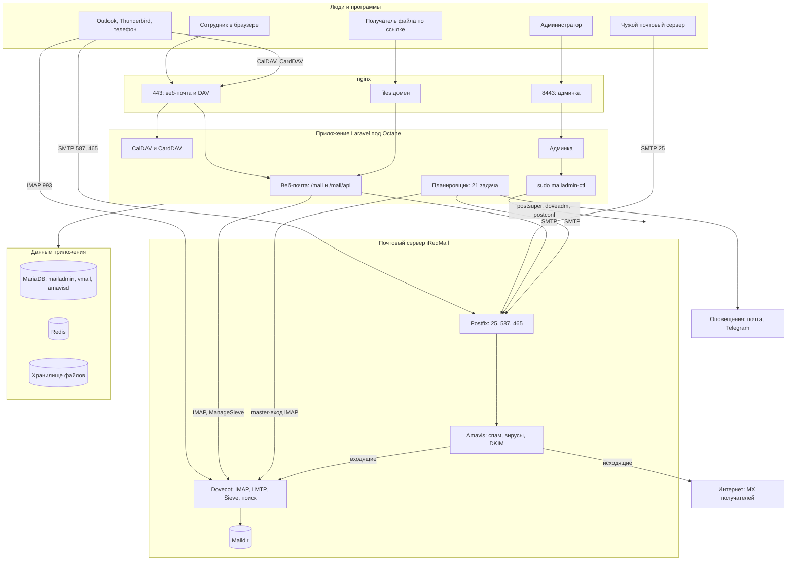

# Архитектура

Документ для того, кто впервые открыл проект. Сначала общая картина одной схемой, потом
из чего она состоит и где что лежит в коде. Подробные схемы отдельных процессов —
в [processes/](processes/README.md).

## Что это

**mailadmin** — веб-почта и панель администратора для почтового сервера на
[iRedMail](https://www.iredmail.org/) (Postfix, Dovecot, Amavis, SpamAssassin, ClamAV,
MariaDB, nginx, fail2ban). Заменяет штатные SOGo и iRedAdmin и закрывает то, чего в них нет:
общие папки, облако для больших вложений, правила с конструктором, календарь и контакты
по CalDAV/CardDAV, обращения сотрудников, журнал действий, очередь, антиспам, отчёты.

Одно приложение Laravel обслуживает две «зоны» на разных портах:

| Зона | Порт | Кто пользуется | Код |
|---|---|---|---|
| Веб-почта | 443, путь `/mail` | сотрудники | `routes/mail.php`, `app/Http/Controllers/Mail`, `resources/js/Pages/Mail` |
| Админка | 8443 | администраторы | `routes/web.php`, `app/Http/Controllers`, `resources/js/Pages/*` |
| Файлы | `files.<домен>` | кто угодно по ссылке | `app/Http/Controllers/Mail/FilesController.php` |
| DAV | 443, путь `/dav/` | телефоны, Outlook, Thunderbird | `app/Dav`, `app/Services/Dav` |

Зону определяет порт запроса (`app/Support/Area.php`); маршрут чужой зоны отвечает 404
ещё до начала сеанса (`EnsureArea`). Штатный iRedAdmin переезжает на 8444.

## Общая схема



Что важно увидеть на схеме:

- **Письма хранит Dovecot, а не приложение.** Веб-почта ходит в него по IMAP, как любая
  почтовая программа. Поэтому Outlook и веб-почта видят одно и то же.
- **Приложение — второй клиент поверх IMAP плюс своя база.** В своей базе лежит то, чего в IMAP
  нет: настройки, правила, метки, отложенные письма, облачные файлы, обращения, журнал действий,
  календари и контакты.
- **Root-операции — только через `mailadmin-ctl`.** Веб-процесс работает от www-data;
  всё, что меняет конфигурацию сервера, идёт через sudo-обёртку с белым списком.
- **Планировщик делает фоновую работу:** отложенная отправка, возврат отложенных писем,
  оповещения, отчёты DMARC, синхронизация книги сотрудников и общих папок, проверка хранилища.

## Составные части

### Внешние системы

| Система | Роль | Как с ней говорит приложение |
|---|---|---|
| Postfix | приём и отправка | SMTP 127.0.0.1:587 с логином пользователя; 127.0.0.1:25 без логина для фоновых задач и входа администратора в ящик |
| Amavis + SpamAssassin + ClamAV | спам, вирусы, карантин, DKIM | таблицы `amavisd`, `mailadmin-ctl amavis-*` |
| Dovecot | хранение, IMAP, доставка, Sieve, полнотекстовый поиск (fts_xapian) | IMAP 127.0.0.1:143 через webklex/php-imap, ManageSieve 4190, `doveadm` через `mailadmin-ctl` |
| MariaDB `vmail` | домены, ящики, псевдонимы, пересылки (схема iRedMail) | модели `app/Models/Vmail` |
| MariaDB `mailadmin` | всё своё | миграции `database/migrations` |
| MariaDB `amavisd`, `iredapd` | карантин, списки, лимиты отправки | `app/Services/Server` |
| Redis | кэш | `CACHE_STORE=redis` |
| LibreOffice | просмотр офисных вложений как PDF | `OfficePdf` |
| mlmmj | рассылки | `mailadmin-ctl mlmmj-*` |
| fail2ban | блокировка перебора паролей | журнал `storage/logs/auth.log`, `mailadmin-ctl f2b-*` |

### Код приложения

```
app/
  Console/Commands/     задачи планировщика и служебные команды
  Dav/                  сервер CalDAV/CardDAV на sabre/dav
  Exceptions/           MailException — ошибки с кодом ответа и русским текстом
  Http/Controllers/     админка
  Http/Controllers/Mail веб-почта: страницы и /mail/api
  Http/Middleware/      зоны, вход, 2FA, роли, журнал действий
  Models/               свои таблицы; Vmail/ — таблицы iRedMail; Webmail/ — данные веб-почты
  Services/Mail/        почтовое ядро (IMAP, письма, отправка, правила, папки)
  Services/Cloud/       облако для больших вложений
  Services/Dav/         календари, контакты, книга сотрудников
  Services/Server/      всё про сервер: очередь, журналы, антиспам, fail2ban, оповещения, проверки
  Services/Vmail/       ящики, псевдонимы в базе iRedMail
  Services/Units/       подразделения
  Services/Migration/   перенос с другого сервера (imapsync, DAV)
  Support/              зоны
deploy/                 установщик, обновление, sudo-обёртка, шаблоны конфигов
resources/js/Pages/     страницы Vue; Mail/ — веб-почта
resources/js/mail/      логика веб-почты (композаблы)
resources/js/Components/Mail/  компоненты веб-почты
routes/web.php          админка;  routes/mail.php — веб-почта, DAV, файлы
routes/console.php      расписание
tests/Unit              быстрые тесты без базы и сервера
```

### Почтовое ядро (`app/Services/Mail`)

`MailStore` — фасад, через который ходят контроллеры. Он делегирует:

| Класс | За что отвечает |
|---|---|
| `ImapSession` | соединение IMAP под пользователем или master-пользователем, SMTP-транспорт |
| `FolderTree` | список папок, роли (Входящие, Отправленные…), счётчики, общие папки, права, квота |
| `MessageListing`, `MessagePage`, `ImapQuery`, `SearchQuery` | список писем, порядок, отбор, поиск |
| `MessageSummary` | одна строка списка из сырых заголовков |
| `Structure` | собственный разбор `BODYSTRUCTURE`: тело, вложения, встроенные картинки |
| `MessageReader`, `MessageBody`, `MessageFetch` | открытие письма без скачивания целиком |
| `MailHtml`, `MailCss` | очистка чужого HTML, блокировка внешних картинок |
| `MailAttachments`, `AttachedMessage`, `OfficePdf` | вложения, архив, вложенные письма, просмотр офисных файлов |
| `ThreadBuilder`, `ThreadIndex` | переписки: свой указатель в базе |
| `MailActions` | флаги, перенос, удаление, дописывание в папку |
| `MailBuilder`, `Outgoing` | сборка и отправка письма, копия в «Отправленные», перевод ошибок SMTP |
| `SieveBuilder`, `ManageSieveClient`, `RuleSet`, `RuleFolders`, `RuleRunner` | правила разбора |
| `FolderShares` | общий доступ к папкам (ACL Dovecot) |
| `ActivityMap` | что считать действием для журнала |

Ошибки ядро бросает как `App\Exceptions\MailException` с кодом (404, 409, 413, 415, 422, 502, 503)
и русским текстом; `bootstrap/app.php` превращает их в JSON `{message}` для `/mail/api/*`.

### Клиент веб-почты

Одностраничное приложение на Vue 3 поверх Inertia. Главная страница — `Pages/Mail/Inbox.vue`,
логика разнесена по композаблам в `resources/js/mail/`: `useLiveUpdates` (опрос новых писем),
`useMessageActions` (действия с окном отмены), `useCompose` (написание и отправка),
`useColumns`, `useUrlState`, `useHotkeys`; `api.js` — все запросы к `/mail/api`, `track.js` — маячок
журнала действий.

## Где какие данные

| Что | Где |
|---|---|
| Письма, папки, флаги, подписки | Dovecot, Maildir на диске |
| Ящики, пароли, псевдонимы, пересылки, общие папки | MariaDB `vmail` |
| Правила пользователя | `webmail_rules` (JSON) и собранный скрипт Sieve в Dovecot |
| Настройки пользователя, 2FA | `webmail_settings` |
| Метки | `webmail_labels` + ключевые слова `Lbl_N` на письмах |
| Отложенные письма, напоминания, отложенная отправка | `webmail_snoozes`, `webmail_reminders`, `webmail_outbox` + `.eml` в `storage/app/outbox` |
| Облачные файлы | `webmail_files` + `storage/app/files/ГГГГ/ММ/<токен>` |
| Переписки | `mail_threads`, `mail_thread_refs` |
| Календари, контакты, задачи | таблицы `dav_*` |
| Сеансы, входы, пароли приложений | `sessions`, `mail_sessions`, `mail_logins`, `app_passwords` |
| Обращения | `feedback_tickets`, `feedback_messages`, файлы в `storage/app/feedback` |
| Журнал действий сотрудников | `webmail_activity` (90 дней) |
| Действия администраторов | `admin_actions` |
| Настройки сервера из админки | `app_settings` |
| Карантин, белые и чёрные списки | MariaDB `amavisd` |

## Принципы, которых держится проект

- **Сервер — источник правды.** Приложение не хранит копий писем; всё, что показано,
  прочитано из Dovecot сейчас.
- **Ничего не ломать безвозвратно.** Удаление — через «Корзину», отправка — с окном отмены,
  опасные операции спрашивают подтверждение.
- **Ошибка — словами.** Пользователь видит, что случилось и что делать, а не текст протокола.
- **Пароли сотрудников меняет только администратор.** Самообслуживания нет сознательно.
- **Комментарии объясняют «почему».** Код пишется по разборам реальных случаев, и комментарий
  рядом говорит, какой случай он закрывает.

Дальше: [разработка](development.md) · [эксплуатация](operations.md) ·
[подводные камни](gotchas.md) · [процессы](processes/README.md)
