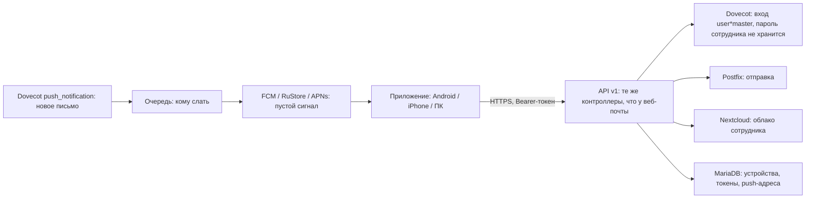
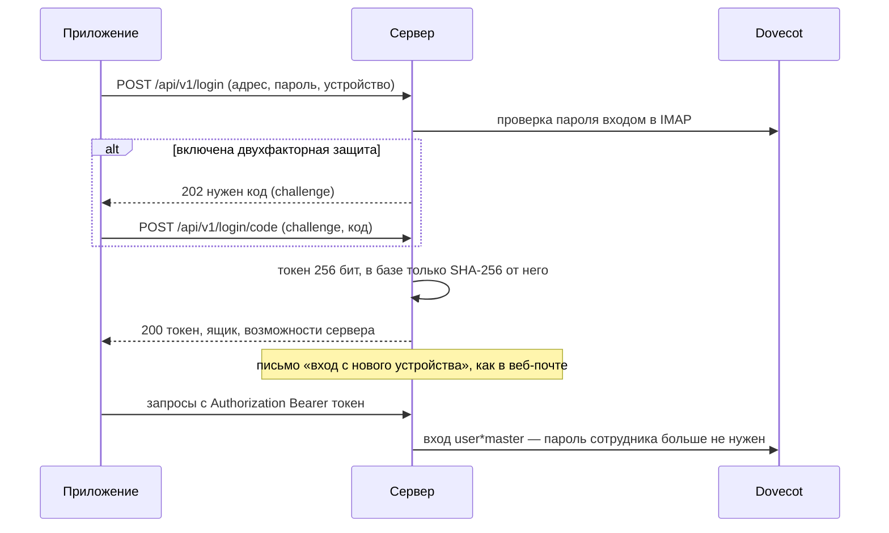
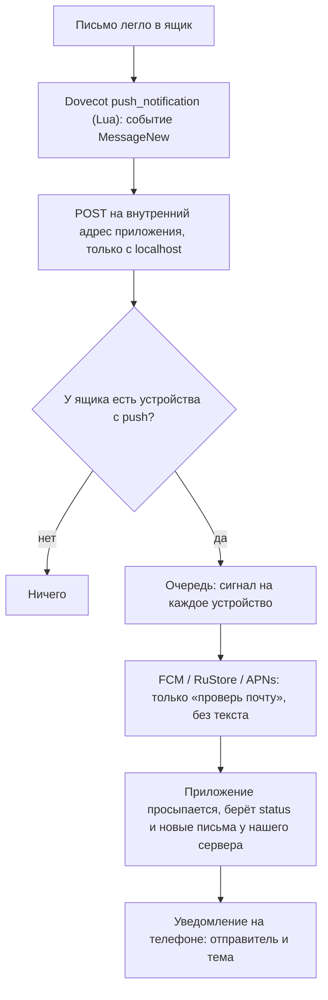

# API для мобильного приложения — план

Что приложению (Android, потом iPhone и ПК; Kotlin Multiplatform + Compose Multiplatform)
нужно от сервера, что из этого уже есть и что предстоит сделать. Приложение не ходит в почту
само: всё через наш сервер, как веб-почта. Так в нём сразу работают облако, общие папки, метки,
«выбрать все», журнал действий — и приходят push-уведомления, которые без своего сервера
на телефоне не сделать.

## Решения (2026-09-25)

- **Функционал — как у веб-почты**, целиком: приложение ходит в те же маршруты (`routes/mail-api.php`
  подключён дважды — `/mail/api` для веб-почты и `/api/v1` для приложения).
- **Сначала Android**, код сразу общий (Kotlin Multiplatform + Compose Multiplatform), потом iPhone и ПК.
- **Раздача — со своего сервера почты** (страница `/app`, подписанный APK в `storage/app/private/mobile`,
  `MobileRelease`), магазины — когда-нибудь потом. Приложение само спрашивает `GET /api/v1/app/latest`,
  сверяет SHA-256 скачанного файла и предлагает обновиться (установка не из магазина обновляется только так).
- **Вход живёт 90 дней без использования** (`security.app_token_days`), уведомления из общих папок
  по умолчанию выключены.

## Сделано на сервере (этап 1)

- `mobile_devices` и `MobileDevices`: токен 256 бит, в базе SHA-256; отзыв, срок, ночная уборка.
- `POST /api/v1/login`, `POST /api/v1/login/code` (2FA), `DELETE /api/v1/session`, `GET /api/v1/me`,
  `GET/DELETE /api/v1/devices`, `POST /api/v1/devices/push`, `GET /.well-known/mailadmin`.
- `MobileToken`: токен → сеанс в памяти на один запрос (`ImapSession::forApp`), служебный вход в ящик,
  отправка через локальный Postfix (адрес «От» проверяет `MailBuilder::pickFrom`, как всегда).
- Весь API веб-почты — под `/api/v1`, плюс обращения (`feedback`).
- Устройства видны в «Безопасность» (сеансы, `kind: app`), отзываются там, в админке и вместе с
  `Sessions::kickAll` (смена пароля, блокировка, удаление ящика).
- Журнал действий: `api/v1/*` пишется как `mail/api/*`, клиент — «Android · приложение 1.0»
  (User-Agent приложения: `MailadminApp/<версия> (<ОС>; <модель>)`).
- Подтверждение паролем (снять 2FA, пароль приложения) в приложении проверяется входом в IMAP.
- Не сделано на этом этапе: подписанные ссылки на файлы для WebView, письмо как документ для
  WebView, загрузка вложений частями, push. Включить 2FA можно только в веб-почте (там QR-код).

## Приложение (2026-09-26)

Код — `mobile/` ([mobile/README.md](../mobile/README.md)): Kotlin Multiplatform + Compose Multiplatform, Android
готов, ПК работает, iPhone — заготовка для сборки на Mac. Весь функционал веб-почты, кроме того, что сознательно
оставлено веб-почте: включение 2FA по QR (в приложении — по ключу).

- Для окна «Написать» добавлен `GET /api/v1/compose-meta` — отправители (свой адрес, псевдонимы, общие ящики с их
  подписью), предел письма и числа файлов, облако, квота, счётчики «Ждут отправки» и «Карантин»: веб-почта
  получает это вместе со страницей.
- Подписанные ссылки для WebView не понадобились: Android-WebView перехватывает запросы встроенных картинок
  (`/mail/api/…`) и приложение загружает их само с токеном; вложения скачиваются клиентом приложения.
- `/message/{папка}/{uid}/thread` отдаёт остальные письма переписки без открытого — приложение добавляет его само.
- Push пока не подключён (нет проекта Firebase): фоновая проверка раз в 15 минут, по выбору — «Мгновенно»
  (служба приложения, раз в минуту).

### Версия 1.1–1.2 (26.09)

- `GET /api/v1/me` отдаёт и `hosts` — адреса и порты IMAP, SMTP и DAV для почтовых программ
  (`HelpController::hosts`, как в «Настройках» веб-почты).
- `GET calendars/{calendar}/export` (и в `/mail/api`, и в `/api/v1`) — календарь одним файлом .ics
  (`Calendars::exportCalendar`): DAV «?export» требует пароль, у приложения только токен.
- Приложение закрыло пробелы с веб-почтой: текст письма и подпись с оформлением (тот же contenteditable, что
  `Editor.vue`), проверки перед отправкой, правило для отправителя (`sender/mark`), быстрый ответ, виды календаря
  «День»/«Неделя», повторы, одна встреча серии (как в вебе: удалить вхождение и создать отдельное событие),
  занятость (`freebusy`), просмотр вложений (в том числе `preview.pdf` для документов Office), печать, фото контакта.
- Выпуски — на самом сервере: `pochta.apk` и `latest.json` (версия, номер сборки, размер, SHA-256, что нового)
  в `storage/app/private/mobile`; приложение обновляется с `/app` и `GET /api/v1/app/latest`.

## 1. Вход и устройства

Сейчас веб-почта держит вход в сессии (cookie + CSRF) и хранит в ней зашифрованный пароль ящика.
Приложению это не подходит: ему нужен токен, который живёт месяцами и который можно отозвать.

- **Пароль ящика на сервере не хранится.** Он проверяется один раз при входе; дальше сервер ходит
  в ящик служебным входом Dovecot (`user*master`, уже настроен на обоих серверах — им пользуется
  «войти как сотрудник» в админке). Токен сам по себе даёт доступ только к своему ящику.
- **Таблица `mobile_devices`**: ящик, имя устройства («Pixel 7, Android 15»), платформа,
  `token_hash`, адрес для push и его вид (fcm / rustore / apns), создан, последний запрос, отозван.
- **Срок**: токен перестаёт действовать после 90 дней без запросов (предложение, решает админ).
- **Отзыв**: «Выйти» в приложении (`DELETE /api/v1/session`); список устройств — в «Настройки →
  Безопасность» веб-почты рядом с сеансами, с кнопкой «выйти на устройстве»; в админке — у ящика.
- **Смена пароля администратором, блокировка входа, удаление ящика** отзывают все токены ящика
  сразу: иначе служебный вход продолжал бы пускать телефон с уже недействительным паролем.
- Двухфакторная защита, обязательная 2FA по требованию администратора и запрет входа — те же
  правила, что у веб-почты (`LoginController`), без исключений для приложения.

## 2. Как приложение находит сервер

`GET https://<хост>/.well-known/mailadmin` → `{ "api": "https://<хост>/api/v1", "name": "Почта …",
"version": "…", "minApp": "1.0", "features": ["cloud", "calendar", …] }`.

Приложение берёт домен из адреса и пробует `mail.<домен>`, затем данные автонастройки
(`/autodiscover`, `autoconfig`), которые у нас уже есть. `minApp` — самая старая версия приложения,
с которой сервер ещё работает: старше — приложение просит обновиться.

## 3. Общие правила

- Только HTTPS, JSON, даты — ISO 8601 с поясом, размеры — в байтах.
- Ошибка: `{ "message": "понятный человеку текст", "code": "invalid|notFound|busy|tooLarge|…" }` —
  тот же `MailException`, что у веб-почты. 401 — токен не годится (приложение уходит на вход),
  409 — письмо переложили, 422 — ошибка в данных, 429 — слишком часто, 503 — почтовый сервер
  не отвечает (повторить позже).
- Списки — кусками `offset` / `limit` (как прокрутка веб-почты, до 200 за раз).
- **Версия заморожена**: в `/api/v1` поля только добавляются, ничего не переименовывается и не
  удаляется. Ломающее изменение — только в `/api/v2`, и сервер держит обе версии, пока `minApp`
  не поднят. Спецификация — `docs/api/openapi.yaml`, тесты сверяют ответы с ней.
- Файлы (вложения, облако) отдаются с поддержкой `Range`: докачка и перемотка видео.

## 4. Что есть и что нужно

Большая часть — существующие контроллеры веб-почты под `/api/v1` с другим способом входа
(`routes/api-mobile.php`, middleware «токен → ImapSession»). Ниже — по разделам экрана.

| Раздел | Запросы v1 | Сейчас в веб-почте | Что доделать |
|---|---|---|---|
| Папки и счётчики | `GET folders`, `GET status` | `FolderController` | — |
| Список писем | `GET list/{папка}?offset&limit`, `GET list-at/{папка}?date` | `MessageController::list`, `listAt` | — |
| Письмо | `GET message/{папка}/{uid}`, `…/thread` | `MessageController::show`, `thread` | HTML для WebView — см. ниже |
| Вложения | `…/attachment/{n}`, `…/attachments.zip`, `…/cloud.zip`, предпросмотр PDF | есть | подписанные ссылки — см. ниже |
| Действия | `POST action` (в т. ч. `all`) | `ActionController` | — |
| Написать, черновики | `POST send`, `POST draft`, `GET draft/{uid}`, `GET/DELETE outbox` | `ComposeController` | вложения загружать заранее, частями |
| Подсказки адресов | `GET suggest` | `SuggestController` | — |
| Контакты | `contacts/*` | `ContactsController` | — |
| Календарь и задачи | `calendars/*`, `events/*`, `tasks/*`, `freebusy` | `CalendarController`, `TasksController` | — |
| Облако сотрудника | `cloud/*` (загрузка частями уже есть) | `PersonalCloudController` | — |
| Большие вложения | `files/*` | `CloudFilesController` | — |
| Настройки, метки, правила | `settings`, `labels/*`, `rules/*`, `sender/mark` | есть | — |
| Безопасность | `security/*` | `MailSecurityController` | устройства приложения в списке сеансов |
| Карантин, обращения | `quarantine/*`, `feedback/*` | есть | — |
| Устройства, push | `login`, `login/code`, `session`, `devices/push` | нет | новое |

### Что меняется в существующем

1. **Вход по токену.** `ImapSession` сейчас берёт ящик и пароль из сессии. Нужен второй источник:
   токен → ящик → служебный вход. Контроллеры менять не придётся — они получают тот же `ImapSession`.
2. **Письмо в WebView.** Веб-почта вставляет очищенный HTML в свою страницу. Приложению нужен
   готовый документ для WebView: тот же очищенный HTML, свой CSP (без скриптов), внешние картинки
   по-прежнему выключены до «Показать картинки».
3. **Подписанные ссылки на файлы.** WebView и загрузчик Android не умеют добавлять заголовок
   `Authorization` к картинкам письма и скачиваниям. Поэтому вложения, встроенные картинки (`cid:`)
   и файлы облака приложение открывает по короткоживущей подписанной ссылке (`…?exp=…&sig=…`,
   10 минут, только для этого ящика и этого файла).
4. **Вложения к письму — заранее и частями.** Сейчас файлы уходят одним запросом вместе с письмом
   (до 500 МБ). С телефона на мобильной связи такой запрос рвётся. Приложение загружает каждый
   файл заранее частями (как облако: `POST uploads`, `PUT uploads/{id}/{n}`, докачка после обрыва),
   а в `send` передаёт номера загрузок. Незаконченные загрузки сервер убирает через сутки.
5. **Журнал действий**: запросы приложения пишутся туда же, клиент — «Android · приложение 1.0».

## 5. Уведомления о новых письмах

- **Через Google и Apple идёт только сигнал**, без отправителя и темы: текст письма не проходит
  через чужие серверы. Отправителя и тему приложение берёт у нас само и показывает уведомление.
  На iPhone для этого нужно расширение уведомлений (Notification Service Extension).
- Телефоны без сервисов Google (Huawei и др.) — RuStore Push; нет и его — проверка раз в 15 минут
  в фоне.
- Уведомления из общих папок (info@ и т. п.) — по выбору сотрудника, по умолчанию выключены.
- Нужно: включить в Dovecot `push_notification` с драйвером Lua (модуль `notify` уже стоит),
  ключ сервиса Firebase (и RuStore), позже — ключ Apple.

## 6. Порядок работ

1. **Устройства и вход**: таблица, токены, `login` и `login/code`, отзыв, `/.well-known/mailadmin`,
   middleware токена, список устройств в веб-почте. Чтение: папки, список, письмо, вложения по
   подписанным ссылкам. Этого хватает, чтобы собрать первое приложение «только читать».
2. **Работа с письмами**: действия, черновики, отправка, загрузка вложений частями.
3. **Push**: Dovecot → очередь → FCM/RuStore.
4. **Контакты, календарь, облако** — запросы уже есть, проверить на приложении.
5. **Работа без сети**: изменения с прошлого раза (CONDSTORE/QRESYNC в Dovecot) вместо
   перечитывания, кэш писем на телефоне.

На каждый шаг — тесты сервера и описание в `docs/api/openapi.yaml`.

## Что решает администратор

- Сколько живёт вход на телефоне без использования (предложение — 90 дней).
- Уведомления из общих папок: выключены по умолчанию или включены.
- Нужен ли RuStore Push (есть ли у сотрудников телефоны без сервисов Google).
- Для iPhone: Mac для сборки и аккаунт разработчика Apple.
