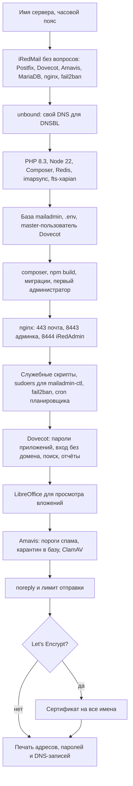
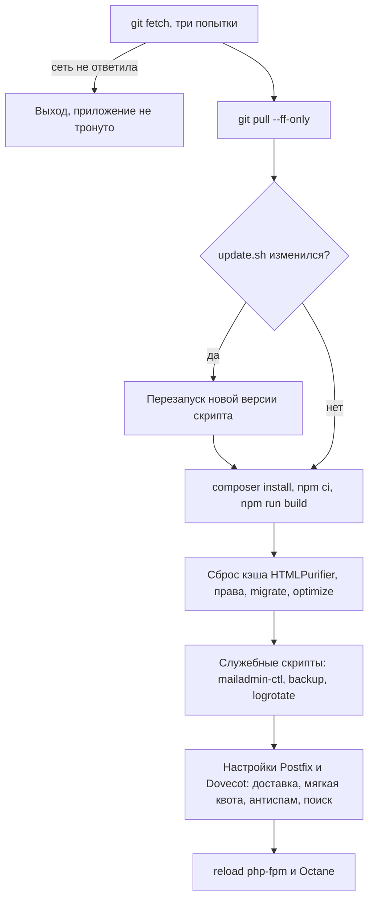

# Эксплуатация

Установка, обновление, из чего состоит работающий сервер, что делается по расписанию
и куда смотреть, когда что-то не так.

## Установка на чистый сервер

Ubuntu 24.04, 2+ ядра, 8 ГБ памяти (ClamAV занимает около гигабайта), белый IP,
имя вида `mail.example.ru` с A-записью на сервер.

```bash
git clone <адрес репозитория> /opt/mailadmin      # путь зашит в шаблоны, менять нельзя
cd /opt/mailadmin/deploy
cp install.conf.example install.conf && nano install.conf
sudo bash install.sh
```

Что делает `install.sh` по порядку (повторный запуск доделывает пропущенное):



Секреты складываются в `/root/mailadmin-install.txt`. В конце скрипт печатает DNS-записи:
A, MX, CNAME для autoconfig/autodiscover, SPF, DKIM, DMARC, PTR.

После установки: перезагрузить сервер, включить 2FA администратора, проверить
«Настройки → Домены и DNS», **один раз запустить `update.sh`** (он ставит часть настроек
Postfix, которых нет в установщике), при желании — `octane-setup.sh` и `files-host.sh`.

## Обновление

```bash
sudo bash /opt/mailadmin/deploy/update.sh [ветка]
```



## Как работает сервер

| Порт / имя | Что |
|---|---|
| 25 | приём почты (postscreen, Postfix) |
| 587, 465 | отправка почтовыми программами с логином |
| 993, 143 | IMAP |
| 4190 | ManageSieve (правила) |
| 443 | веб-почта `/mail`, DAV `/dav/`, autoconfig, autodiscover |
| 8443 | админка |
| 8444 | iRedAdmin |
| `files.<домен>` | скачивание больших вложений по ссылке |
| 127.0.0.1:8000 | Octane (RoadRunner) |
| 127.0.0.1:9999 | php-fpm (запасной путь) |

**Octane.** `deploy/octane-setup.sh` переводит приложение на RoadRunner: служба
`mailadmin-octane`, рабочие процессы держат приложение в памяти между запросами. Откат —
`deploy/octane-off.sh`, php-fpm остаётся на месте. Сайт `files.<домен>` работает только при Octane.

**Пределы размера.** Должны совпадать на всех слоях, иначе большие вложения получают 413:

| Слой | Предел |
|---|---|
| nginx сайтов почты | 520 МБ |
| RoadRunner (`.rr.yaml`) | 520 МБ |
| CLI-PHP для Octane (`99-mailadmin.ini`) | 520 МБ / 500 МБ |
| php-fpm | 260 МБ |
| внешний прокси (если есть) | задать не меньше, чем на сервере |
| Postfix `message_size_limit` | 40 МБ на письмо; больше — через облако |

**Внешний прокси.** Если перед сервером стоит nginx, пример — `deploy/proxy-nginx-mail.conf.example`.
Адрес прокси обязательно в `TRUSTED_PROXIES`.

## Что делается по расписанию

Всё в `routes/console.php`, запускается cron-строкой `schedule:run` раз в минуту.

| Задача | Когда | Что делает |
|---|---|---|
| `mail:wake` | каждую минуту | возвращает отложенные письма, напоминает «нет ответа» |
| `mail:outbox` | каждую минуту | отправляет письма, отложенные на время |
| `mail:sent-retry` | каждую минуту | досохраняет копии в «Отправленные» после сбоя |
| `feedback:import` | каждую минуту | подшивает ответы на обращения, пришедшие письмом |
| `calendar:reminders` | каждую минуту | напоминания о событиях календаря |
| `quarantine:digest` | в заданное время | сводка карантина сотрудникам |
| `backup:run --if-due` | в заданное время | резервная копия |
| `alerts:check` | каждые 5 минут | оповещения о проблемах сервера |
| `alerts:check --digest` | в заданное время (09:00) | ежедневная сводка |
| `shares:sync` | каждые 10 минут | права на папки, созданные после выдачи общего доступа |
| `threads:sync --all` | каждые 10 минут | указатель переписок |
| `dav:sync-employees` | каждый час | книга «Сотрудники» по списку ящиков |
| `reports:fetch` | каждый час | отчёты DMARC и TLS-RPT |
| `backup:run --purge-quarantine` | 04:10 | чистка карантина по сроку |
| `external-senders:refresh` | 04:10 | адреса mail.ru, Яндекса, Gmail для отправки от наших адресов |
| очистка кэша просмотра | 04:20 | PDF-просмотры старше недели |
| `files:purge` | 04:30 | просроченные облачные файлы (по умолчанию не удаляет ничего) |
| `files:check` | 04:35 | целостность хранилища по размеру |
| `files:check --hash` | вс 04:50 | целостность по контрольной сумме |
| `activity:prune` | 04:40 | журнал действий старше 90 дней |

Вне расписания: `migrate:run` (перенос ящиков), `dav:import`, `rules:sync`,
`setup:bootstrap`, `admin:create`, `mail:fix-subscriptions`.

## Права root: `mailadmin-ctl`

Приложение работает от www-data. Единственная строка в sudoers разрешает ему
`/usr/local/sbin/mailadmin-ctl`, а эта обёртка — белый список подкоманд с проверкой
аргументов. Группы: очередь Postfix, fail2ban, Dovecot (`who`, `kick`, ACL), Sieve (общий скрипт),
Amavis и Postfix (`postconf`, пороги, антивирус, выпуск из карантина), DKIM, сертификат,
резервные копии, рассылки mlmmj, сведения о системе.

## Где смотреть, когда что-то не так

| Что | Где |
|---|---|
| Всё ли живо | админка → «Состояние»: службы, очередь, ошибки, фоновые задачи, диск, сертификат |
| Что делали сотрудники, где ошибки и медленные ответы | админка → «Активность» |
| Путь конкретного письма | админка → «Журналы» (поиск по адресу, Message-ID, ID очереди) или «Проверить адрес» |
| Очередь | админка → «Очередь» |
| Ошибки приложения | `storage/logs/laravel-ГГГГ-ММ-ДД.log` |
| Неудачные входы | `storage/logs/auth.log` (его читает fail2ban) |
| Почтовый журнал | `/var/log/mail.log`, `/var/log/dovecot/*.log` |
| Octane | `journalctl -u mailadmin-octane` |
| Ночная сводка одной командой | `deploy/nightcheck.sh` (только читает) |

Типичные ситуации:

- **Большое вложение не уходит, 413.** Сверить пределы из таблицы выше, в том числе на внешнем прокси.
- **Папка пропала в Outlook после переименования.** Подписки: `php artisan mail:fix-subscriptions --apply`.
- **Письма от кого-то перестали приходить.** «Журналы» по адресу отправителя: чаще всего
  отказ по HELO (сервер отправителя называет себя именем без DNS) или по DNSBL.
- **Письма не уходят на какой-то домен.** «Очередь»: причина в столбце. Опечатка в домене,
  нет PTR у нашего адреса, получатель отвергает по SPF.
- **Поиск ничего не находит сразу после переноса почты.** Индекс строится в фоне; ночью его догоняет таймер `mailadmin-index-nightly`.

## Переезд с другого сервера

Два пути, оба в админке или из консоли:

- **По IMAP** («Настройки → Перенос»): нужны пароли на старом сервере; `imapsync` под
  master-пользователем, плюс контакты и календари по CardDAV/CalDAV. Задача `migrate:run`.
- **Из хранилища Kerio без паролей**: `deploy/kerio2maildir.py` копирует письма прямо в Maildir
  с папками и флагами, повторный запуск докачивает новое; `deploy/kerio-dav-extract.py` и
  `artisan dav:import` переносят контакты и календари. Подробно — в README.

Схема обоих путей — [processes/migration.md](processes/migration.md).
