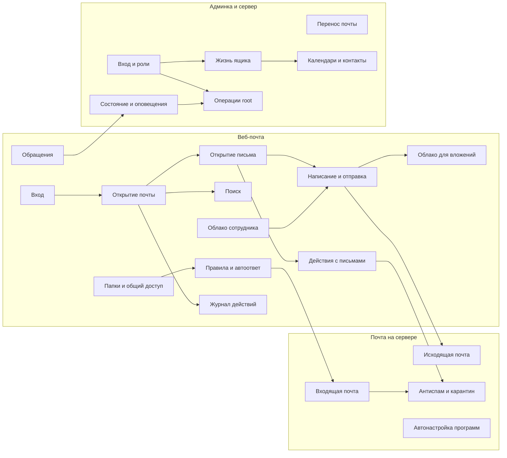

# Процессы

Каждый файл — одна блок-схема процесса и короткое описание, где это в коде. Общая схема
всей системы — в [architecture.md](../architecture.md#общая-схема).

## Карта процессов

## Почта на сервере

| Процесс | Файл |
|---|---|
| Входящая почта: от чужого сервера до папки | [inbound-mail.md](inbound-mail.md) |
| Исходящая почта: программы, веб-почта, фоновые задачи | [outbound-mail.md](outbound-mail.md) |
| Антиспам и карантин | [antispam-quarantine.md](antispam-quarantine.md) |
| Автонастройка почтовых программ | [autoconfig.md](autoconfig.md) |

## Веб-почта

| Процесс | Файл |
|---|---|
| Вход, 2FA, вход администратора в ящик | [webmail-login.md](webmail-login.md) |
| Открытие почты: папки, список, живое обновление | [mailbox-view.md](mailbox-view.md) |
| Открытие письма, вложения, переписка | [open-message.md](open-message.md) |
| Написание, черновики, отправка с отменой, отложенная отправка | [compose-send.md](compose-send.md) |
| Действия с письмами, отложить, напомнить | [message-actions.md](message-actions.md) |
| Поиск | [search.md](search.md) |
| Папки и общий доступ | [folders-and-shares.md](folders-and-shares.md) |
| Правила и автоответ | [rules.md](rules.md) |
| Облако для больших вложений | [cloud-files.md](cloud-files.md) |
| Облако сотрудника: папки, загрузка с докачкой, ссылки | [personal-cloud.md](personal-cloud.md) |
| Обращения сотрудников | [feedback.md](feedback.md) |
| Журнал действий и «Активность» | [activity-log.md](activity-log.md) |

## Админка и сервер

| Процесс | Файл |
|---|---|
| Вход в админку, зоны, роли, журнал администраторов | [admin-access.md](admin-access.md) |
| Жизнь ящика, псевдонимы, подразделения, книга сотрудников | [mailbox-lifecycle.md](mailbox-lifecycle.md) |
| Операции root через `mailadmin-ctl` | [privileged-ops.md](privileged-ops.md) |
| Состояние сервера и оповещения | [alerts-health.md](alerts-health.md) |
| Календари, контакты, задачи | [dav.md](dav.md) |
| Перенос почты с другого сервера | [migration.md](migration.md) |
| Установка и обновление | [operations.md](../operations.md) |
