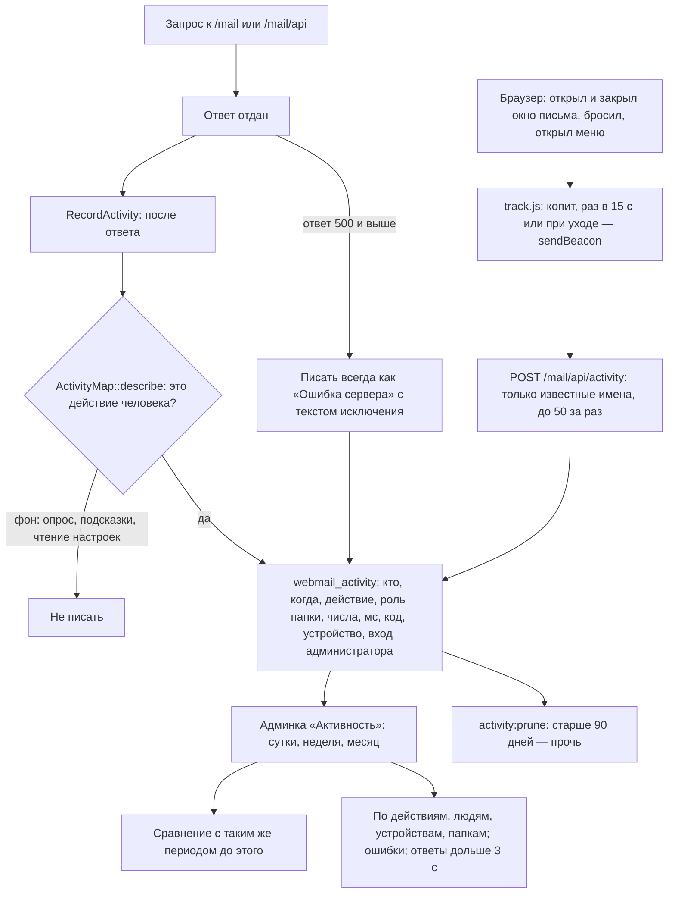

# Журнал действий сотрудников и страница «Активность»

Чтобы видеть, чем люди пользуются, где ждут и где спотыкаются, каждое осмысленное действие
в веб-почте пишется одной строкой. Записываются только тип действия и числа — ни тем,
ни адресов, ни текста поиска.

## Код

`Middleware/RecordActivity`, `Services/Mail/ActivityMap` (правила и подписи, тест `ActivityMapTest`),
`resources/js/mail/track.js`, `Mail/Api/ActivityController`, в админке — `ActivityController` и
`Pages/Activity/Index.vue`, задача `ActivityPrune`.

Новое действие веб-почты надо добавить в `ActivityMap`, иначе журнал его не увидит.
