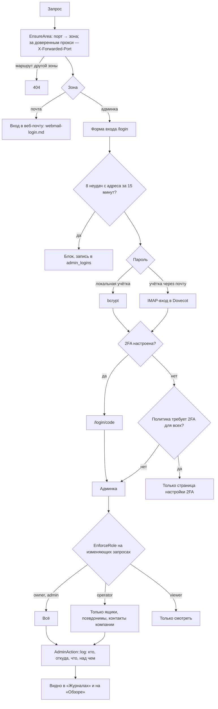

# Вход в админку, зоны, роли, журнал действий администраторов

Админка и веб-почта — одно приложение, разделённое по портам. Запрос на маршрут чужой
зоны получает 404 раньше, чем начнётся сеанс.

## Код

`Support/Area`, `Middleware/EnsureArea`, `Auth/LoginController`, `Auth/TwoFactorController`,
`Middleware/EnsureTwoFactorVerified`, `Middleware/EnforceRole`, `Models/User` (роли), `Models/AdminAction`,
`Settings/AdminsController`. Первый администратор создаётся установщиком: `php artisan admin:create`.
