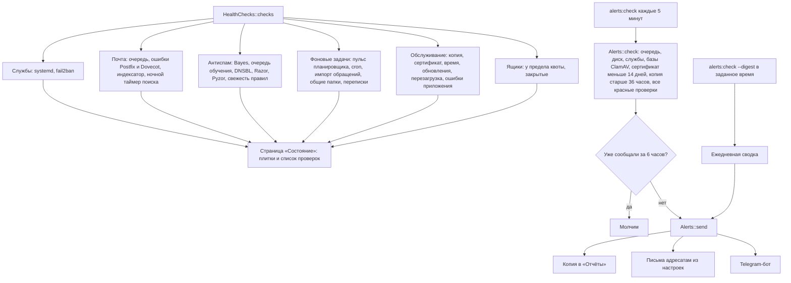

# Состояние сервера и оповещения

Страница «Состояние» собирает проверки в одном месте, а задача `alerts:check` каждые
5 минут превращает красные проверки в оповещения на почту и в Telegram.

## Код

`HealthController`, `Server/HealthChecks`, `Services/ServerHealth`, `Server/Alerts`,
`Settings/AlertsController`, `Server/SystemReports`, `SystemReportsController`, задача `AlertsCheck`.
Отчёты Logwatch и cron-скриптов iRedMail складываются в `/var/lib/mailadmin/reports`
через `deploy/mailadmin-report` вместо писем на postmaster.
