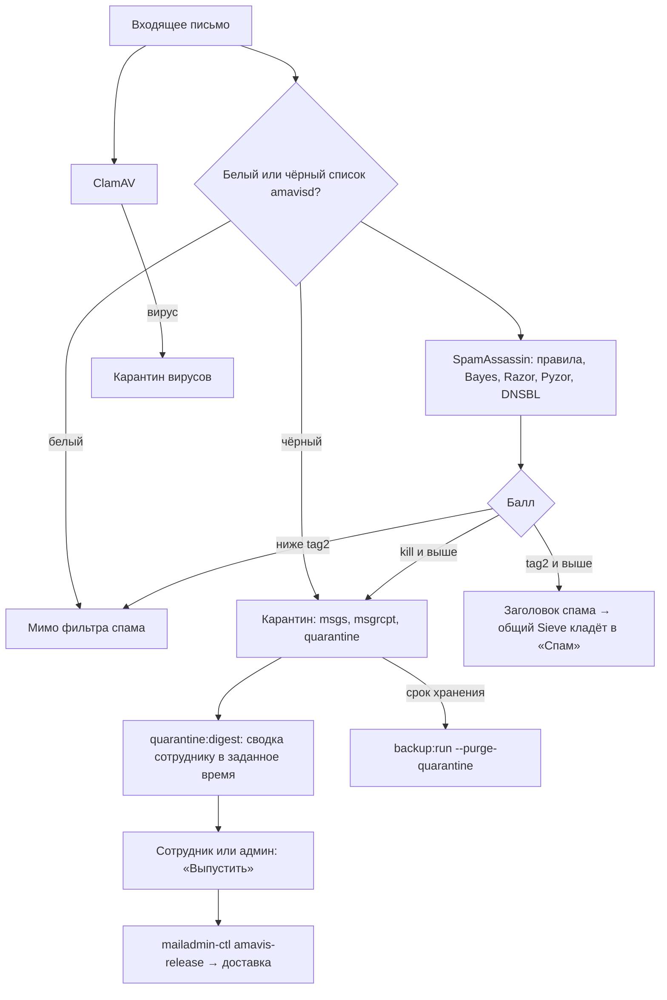
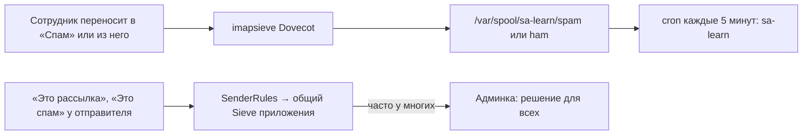

# Антиспам и карантин

Письмо оценивает Amavis со SpamAssassin и ClamAV. Сомнительное — помечается, явный спам
и вирусы — в карантин в базе. Сотрудники решают по отправителям, администратор — по порогам
и спискам; обучение идёт само из переносов в «Спам».

## Код

`AntispamController`, `Settings/SpamController`, `Server/Antispam`, `Server/AmavisConfig`,
`Server/WbList`, `Server/Quarantine`, `Mail/SenderRules`, `Mail/QuarantineController`,
задача `QuarantineDigest`; настройка обучения — `deploy/dovecot-fts-learn.sh`,
DNSBL — `deploy/antispam-extras.sh`.
