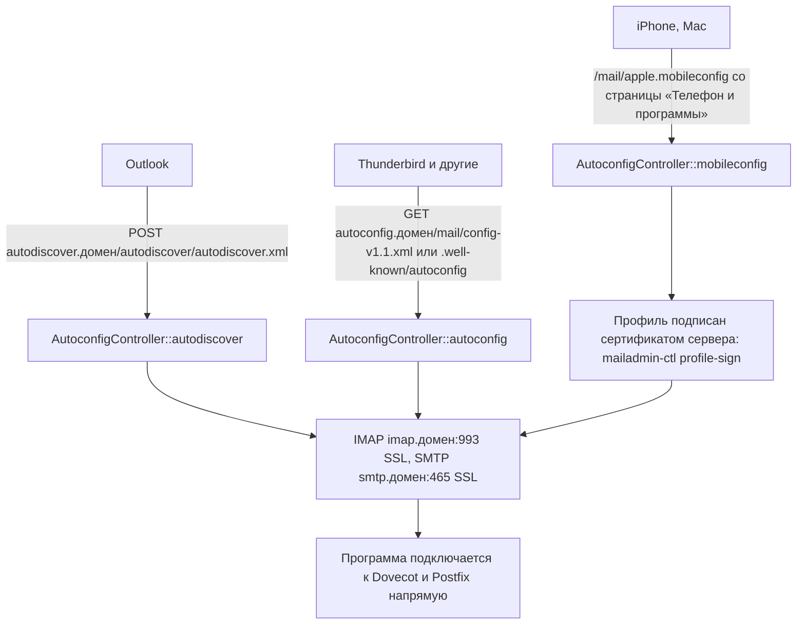

# Автонастройка почтовых программ

Человек вводит только адрес и пароль, программа сама узнаёт серверы и порты.

Нужны DNS-записи `autoconfig` и `autodiscover` (CNAME на имя сервера); установщик печатает их
в конце. SRV-записи `_autodiscover._tcp`, `_imaps._tcp`, `_submission._tcp` не обязательны,
но помогают части программ.

Код: `Mail/AutoconfigController`, маршруты в начале `routes/mail.php`.
