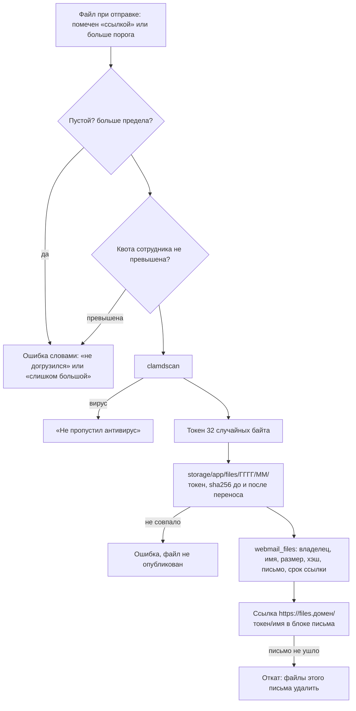
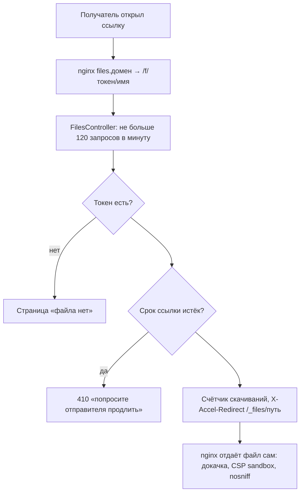
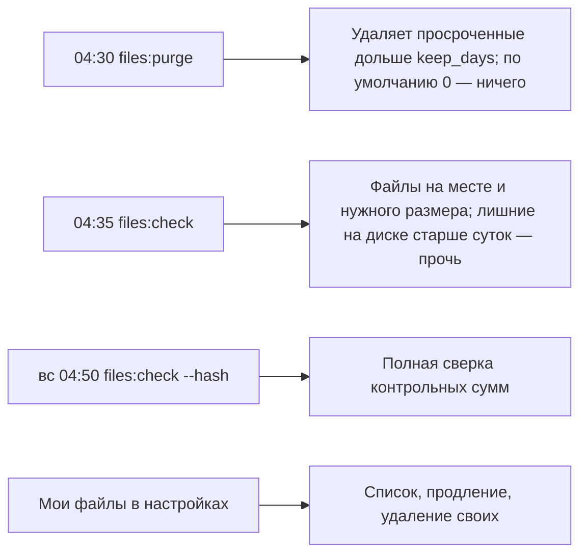

# Облако для больших вложений

Файлы больше порога не кладутся в письмо, а публикуются на своём сервере; в письмо уходит
блок со ссылками. Ссылка продлевается, файл по умолчанию не удаляется. Скачивание отдаёт
сам nginx, приложение только проверяет токен.

## Код

`Services/Cloud/Cloud` (выбор: своё хранилище или Nextcloud), `Services/Cloud/LocalFiles`
(`publish`, `scan`, `discardTokens`, `discardForMessage`, `check`, `purge`, `cardsIn`),
`Mail/FilesController`, `Mail/Api/CloudFilesController`, `Models/Webmail/CloudFile`,
задачи `FilesPurge`, `FilesCheck`; nginx — `deploy/nginx-files.conf.tpl`, `deploy/files-host.sh`.

Настройки («Файлы и облако» в админке): порог, предел файла, срок ссылки, предел просмотра,
квота сотрудника, имя сайта файлов.
