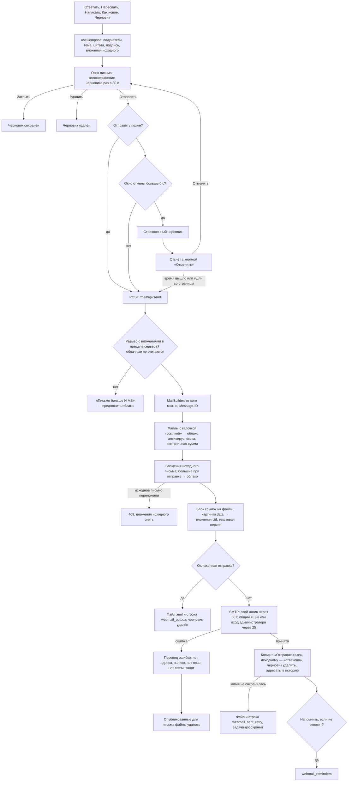
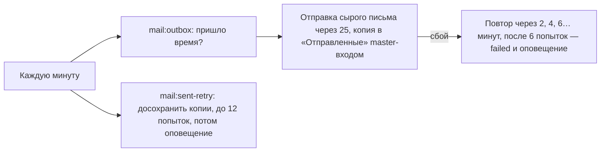

# Написание письма, черновики, отправка с отменой, отложенная отправка

Отправка не уходит сразу: несколько секунд письмо ждёт в браузере, и «Отменить» возвращает
его в редактор. Перед этим сохраняется страховочный черновик. Большие файлы уходят ссылкой
на своё облако. Ошибка SMTP объясняется словами, а опубликованные для письма файлы откатываются.

## Код

Клиент: `mail/useCompose.js`, `Components/Mail/Compose.vue`, `Components/Mail/Editor.vue`.
Сервер: `Mail/Api/ComposeController` (`send`, `draft`, `openDraft`), `MailBuilder`
(`build`, `publishToCloud`, `keptAttachments`, `attachedMails`, `cloudBlockHtml`), `Outgoing`
(`send`, `deliver`, `smtpFailure`, `keepSentCopy`, `saveDraft`, `sendRaw`), `LocalFiles`,
задачи `MailOutbox`, `MailSentRetry`.

- **Черновик** сохраняется в «Черновики» с флагами `\Seen \Draft`, получает новый UID,
  старая версия удаляется. Если файлы не менялись, отправляется только текст, вложения
  сервер берёт из прошлой версии.
- **От чьего имени можно писать**: свой адрес, свои псевдонимы, общий ящик, на который выдано
  право «владелец». Остальное — 422.
- **Пересылка вложением** прикладывает исходные письма как `message/rfc822`.
