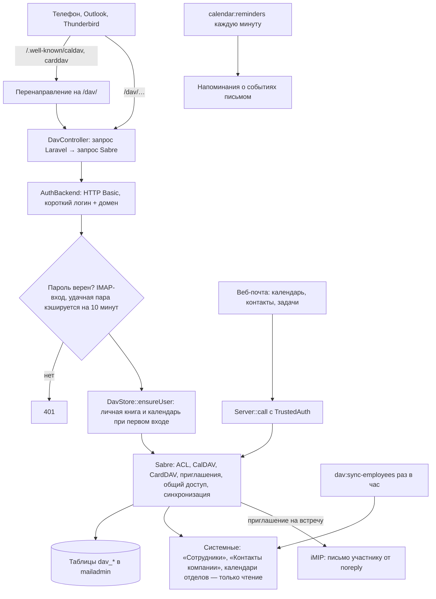

# Календари, контакты и задачи (CalDAV, CardDAV)

Свой сервер DAV на sabre/dav внутри приложения. Телефоны, Outlook и Thunderbird подключаются
к нему напрямую, веб-почта — через тот же сервер внутренним вызовом.

## Код

`app/Dav/Server.php` (сборка сервера), `app/Dav/AuthBackend`, `CardBackend`, `CalBackend`, `IMip`,
`TrustedAuth`; `Mail/DavController`; `Services/Dav/DavStore` и помощники (`Calendars`,
`ContactBooks`, `DavTasks`, `DavSharing`, `DavProvisioning`, `EmployeeBook`); задачи
`CalendarReminders`, `DavSyncEmployees`, `DavImportFiles`.

Предложения сотрудников в «Контакты компании» одобряет администратор (`CompanyContactsController`).
