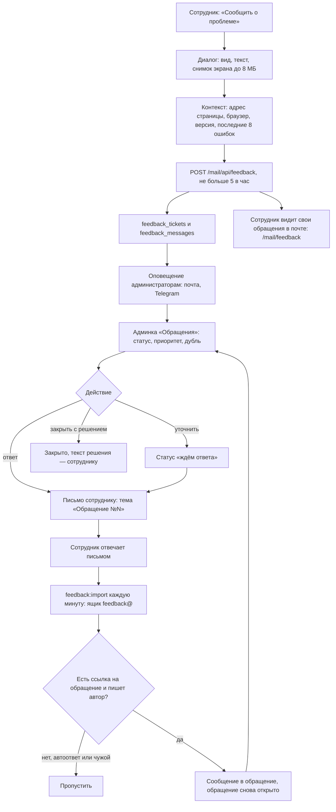

# Обращения сотрудников

Сотрудник пишет обращение прямо из почты (ошибка, пожелание, вопрос) — к нему автоматически
прикладывается, где он был и какие ошибки видел. Администратор отвечает в админке, ответ
уходит сотруднику письмом; ответ письмом подшивается обратно в обращение.

## Код

Почта: `Mail/FeedbackController`, `Components/Mail/FeedbackDialog.vue`, `Pages/Mail/Feedback.vue`.
Админка: `FeedbackController` (`reply`, `close`, `reopen`, `update`). Письма — `FeedbackNotifier`,
приём ответов — задача `FeedbackImport`.
