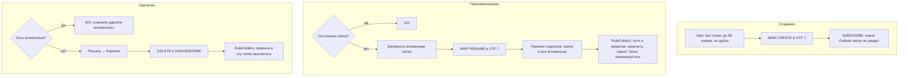
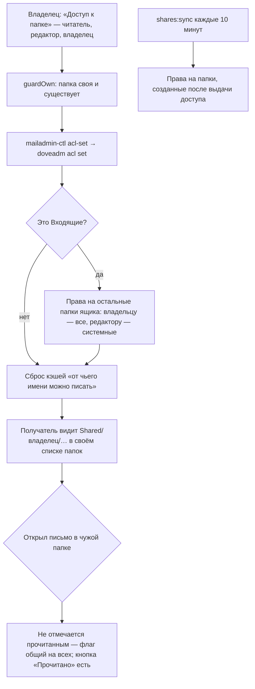

# Папки и общий доступ

Папки живут в Dovecot. Приложение следит за тем, чего Dovecot сам не делает: переносит
подписки при переименовании, тянет за папкой правила, раздаёт права на новые папки
общего ящика.

## Код

`Mail/Api/FolderController`, `FolderTree` (`createFolder`, `renameFolder`, `resubscribe`, `deleteFolder`,
`unmangle`), `MailStore::deleteFolder`, `RuleFolders`, `FolderShares`, задача `SharesSync`,
в админке — `SharesController`. Уборка подписок: `php artisan mail:fix-subscriptions [--apply]`.

Уровни доступа: читатель (смотреть, отмечать прочитанным), редактор (плюс переносить,
удалять, писать в папку), владелец (всё, включая отправку от имени ящика; только для Входящих).
