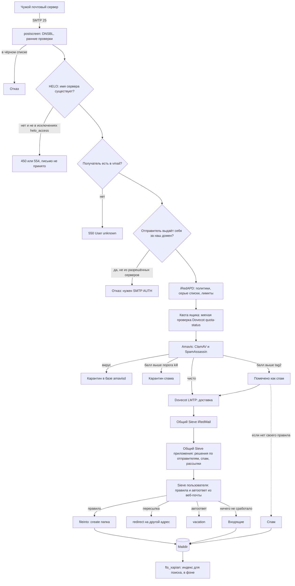

# Входящая почта: от чужого сервера до папки

Письмо извне проходит Postfix, фильтры Amavis и попадает в Dovecot, где правила Sieve
раскладывают его по папкам. Приложение в этом пути не участвует напрямую: оно готовит
правила (Sieve), списки антиспама и карты Postfix, которые здесь срабатывают.

## Где это настраивается

| Шаг | Где |
|---|---|
| DNSBL для postscreen | `deploy/antispam-extras.sh` |
| Исключения HELO | `/etc/postfix/helo_access.pcre` (iRedMail) |
| Отправка «от нашего домена» с mail.ru, Яндекса, Gmail | `Server/ExternalSenders`, `mailadmin-ctl external-senders`, задача `external-senders:refresh` |
| Мягкая квота | `deploy/postfix-quota-soft.sh` |
| Пороги спама, карантин | админка «Антиспам», `Server/AmavisConfig`, `Server/Quarantine` |
| Общий Sieve приложения | `Mail/SenderRules`, `mailadmin-ctl sieve-global` |
| Sieve пользователя | [правила](rules.md) |
| Обучение спама: перенос в «Спам» и обратно | imapsieve, `deploy/dovecot-fts-learn.sh`, cron `mailadmin-salearn` |
| Поисковый индекс | `deploy/dovecot-fts-learn.sh`, таймер `mailadmin-index-nightly` |

## Что может пойти не так

- Сервер отправителя представляется именем без DNS — отказ по HELO, письмо теряется у
  отправителя. Лечится строкой-исключением в `helo_access.pcre`.
- Правило пользователя указывает на удалённую папку — `fileinto :create` создаст её заново.
  Поэтому при удалении папки приложение выключает такие правила ([папки](folders-and-shares.md)).
