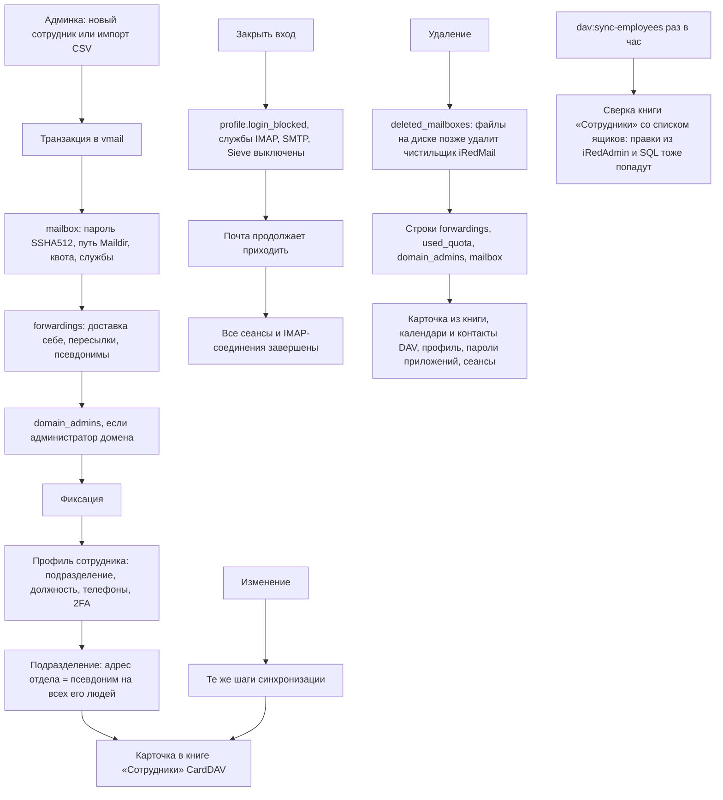
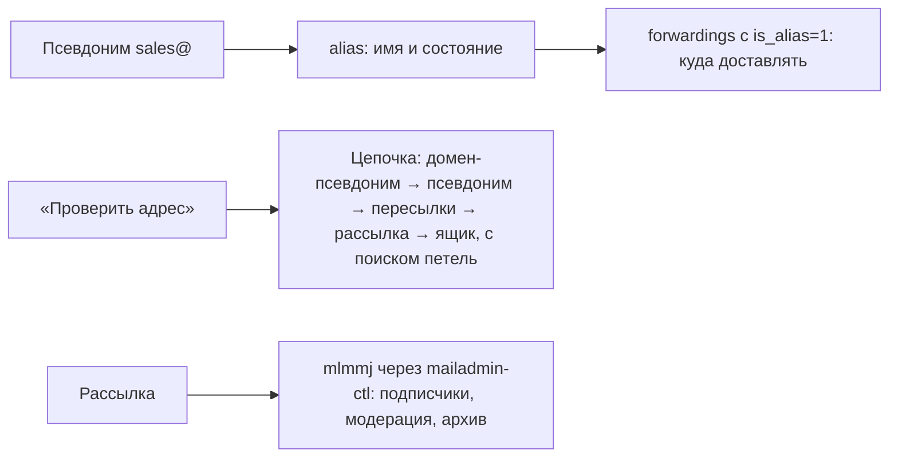

# Жизнь ящика: создание, изменение, блокировка, удаление; псевдонимы, подразделения, книга сотрудников

Ящики живут в базе iRedMail `vmail`. Приложение пишет туда те же строки, что iRedAdmin,
и дополнительно ведёт свой профиль сотрудника и адресную книгу.

## Псевдонимы и рассылки

## Код

`MailboxController`, `EmployeeController`, `ImportController`, `Services/Vmail/MailboxService`
(`create`, `update`, `delete`, `setLoginBlocked`), `AliasController`, `Services/Vmail/AliasService`,
`AddressResolver::trace`, `MaillistsController`, `Server/Mlmmj`, `UnitsController`,
`Services/Units/UnitService`, `Services/Dav/EmployeeBook`, задача `DavSyncEmployees`.

Пароли сотрудникам задаёт и меняет только администратор: самостоятельной смены пароля нет сознательно.
