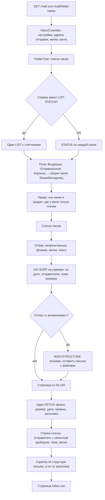
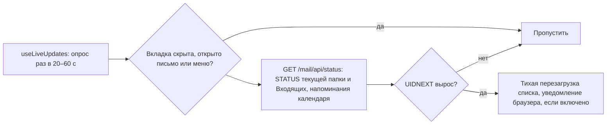

# Открытие почты: папки, список писем, живое обновление

Список строится одним-двумя запросами к Dovecot на страницу из 40 писем: порядок —
серверной сортировкой, строки — одним FETCH заголовков и превью, скрепка — по структуре письма.

## Код

`Mail/InboxController`, `Services/Mail/FolderTree`, `MessageListing`, `ImapQuery`,
`MessagePage`, `MessageSummary`, `Structure`; клиент — `Pages/Mail/Inbox.vue`,
`Components/Mail/MessageList.vue`, `mail/useLiveUpdates.js`.

Сортировка, которая длилась больше 2 секунд, запоминается на 30 минут, и следующий раз список
берётся без неё. После любой ошибки IMAP соединение пересоздаётся.
