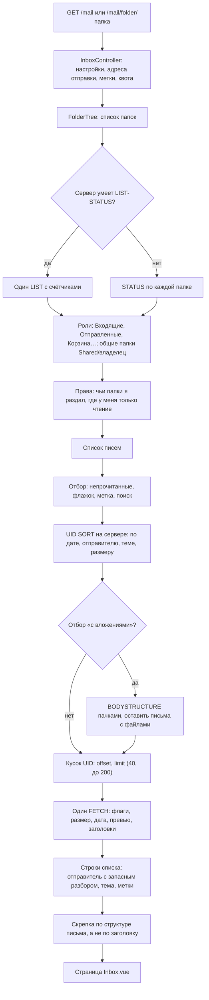
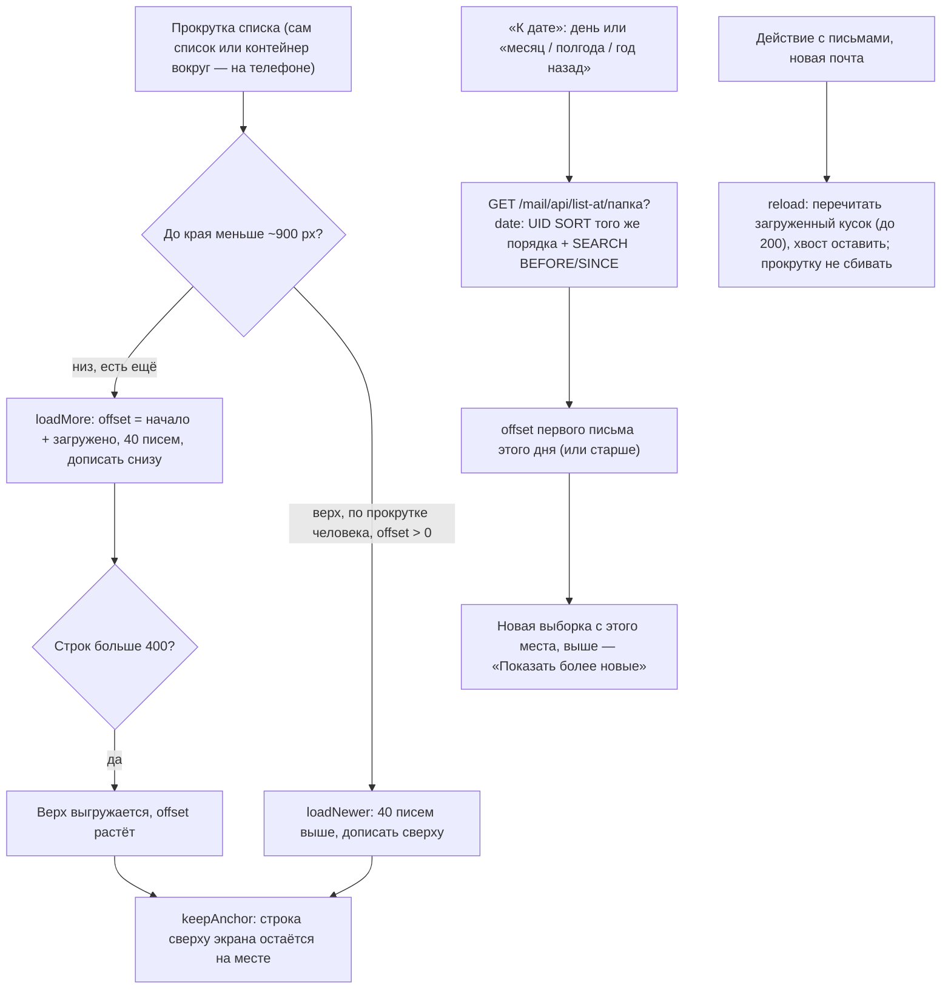
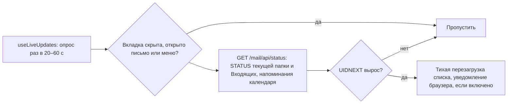

# Открытие почты: папки, список писем, живое обновление

Список строится одним-двумя запросами к Dovecot на кусок из 40 писем: порядок —
серверной сортировкой, строки — одним FETCH заголовков и превью, скрепка — по структуре письма.
Страниц нет: список дочитывается при прокрутке, к нужному месту ведёт «К дате».

## Прокрутка и переход к дате

Порядок «по дате» — по времени получения (ARRIVAL), поэтому и переход к дате ищет по нему
(BEFORE/SINCE, а не SENTBEFORE). Удалённые письма убираются из списка сразу, и следующая
подгрузка берёт offset = начало + сколько строк на экране — сдвиг сервера и экрана совпадает.

## Живое обновление

## Код

`Mail/InboxController`, `Services/Mail/FolderTree`, `MessageListing`, `ImapQuery`,
`MessagePage`, `MessageSummary`, `Structure`; клиент — `Pages/Mail/Inbox.vue`,
`Components/Mail/MessageList.vue` (прокрутка, `keepAnchor`, «К дате»), `mail/useLiveUpdates.js`.
Переход к дате — `MessageListing::offsetForDate`, маршрут `list-at/{folder}`.

Сортировка, которая длилась больше 2 секунд, запоминается на 30 минут, и следующий раз список
берётся без неё. После любой ошибки IMAP соединение пересоздаётся.
