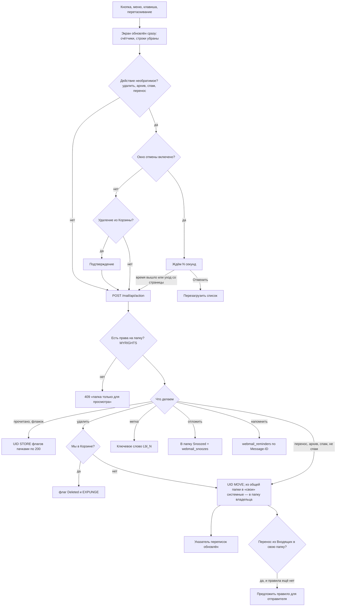
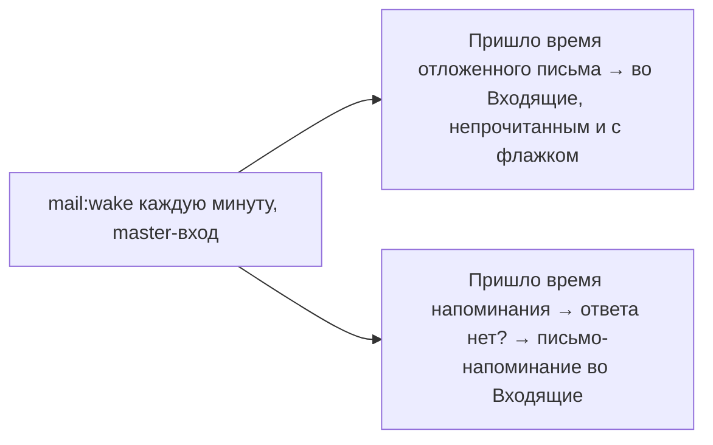

# Действия с письмами: прочитано, флажок, перенос, удаление, спам, метки, отложить, напомнить

Экран меняется сразу, а необратимые действия уходят на сервер с задержкой: в это время
«Отменить» просто перезагружает список, потому что на сервере ещё ничего не случилось.

## Код

Клиент: `mail/useMessageActions.js`. Сервер: `Mail/Api/ActionController`, `MailActions`
(`flag`, `move`, `delete`), `FolderTree::rolePath`, задача `MailWake`.

Перенос в «Спам» и обратно дополнительно обучает SpamAssassin (imapsieve на стороне Dovecot).
В чужой общей папке «Отложить» недоступно.
