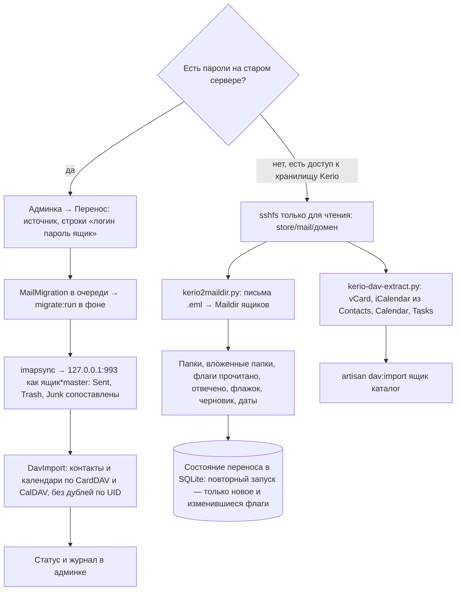

# Перенос почты с другого сервера

Два пути: по IMAP, если известны пароли на старом сервере, и прямо из хранилища Kerio,
если паролей нет. Оба повторяемы: второй запуск докачивает только новое.

## Код и что учесть

`MigrationController`, `Services/Migration/Imapsync`, `Services/Migration/DavImport`,
задача `MigrateRun`; `deploy/kerio2maildir.py`, `deploy/kerio-dav-extract.py`, команда `DavImportFiles`.

- Ящики на новом сервере должны быть заведены заранее.
- `kerio2maildir.py` переносит флаг «черновик» только для папки «Черновики». Черновики Outlook,
  лежавшие в других папках, после переноса выглядят как письма без отправителя и даты.
- После переноса подписки на папки сверить: `php artisan mail:fix-subscriptions`.
