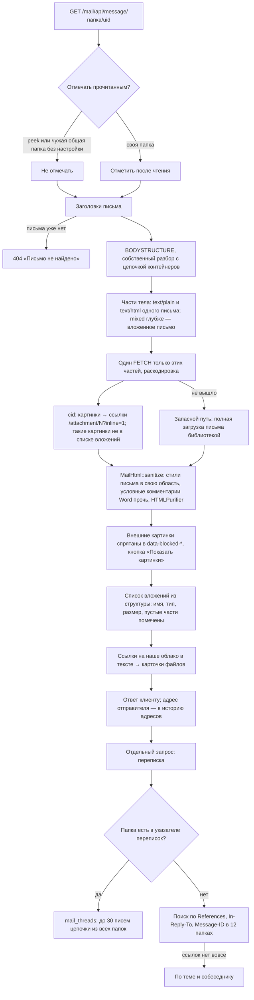
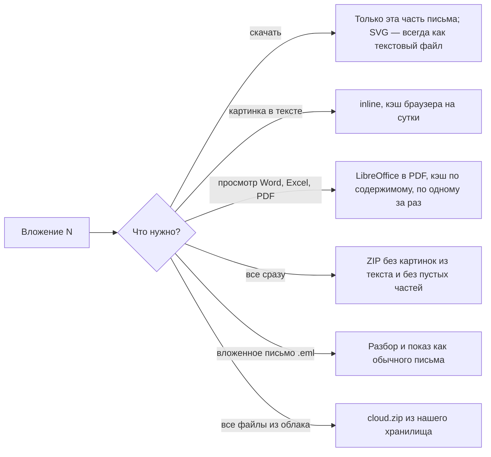

# Открытие письма, вложения, переписка

Письмо не скачивается целиком. По структуре (`BODYSTRUCTURE`) выбираются части с текстом,
скачиваются одним запросом, вложения показываются списком без загрузки, картинки из текста
тянет браузер по отдельным ссылкам с кэшем.

## Код

`Mail/Api/MessageController` (`show`, `thread`, `attachment`, `attachmentPreview`, `attachmentsZip`,
`cloudZip`, `attachedMessage`, `raw`), `MessageBody`, `Structure`, `MailHtml`, `MailCss`,
`MailAttachments`, `OfficePdf`, `AttachedMessage`, `ThreadBuilder`, `ThreadIndex`,
`LocalFiles::cardsIn`; клиент — `Components/Mail/MessageView.vue`.

Указатель переписок заполняет задача `threads:sync --all` раз в 10 минут и каждое перемещение письма.
