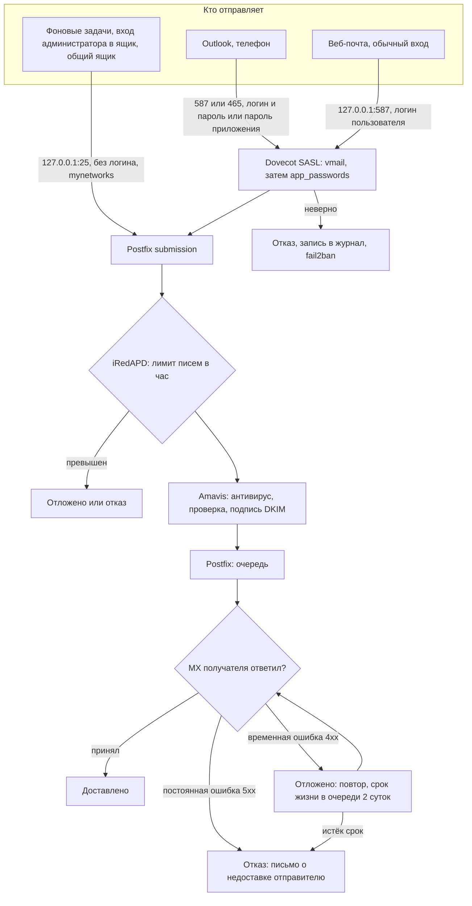

# Исходящая почта: от почтовой программы и веб-почты до получателя

Три источника отправки сходятся в Postfix: почтовые программы, веб-почта от имени
пользователя и фоновые задачи приложения. Дальше общий путь через Amavis с подписью DKIM
прямо на MX получателя, без промежуточного релея.

## Детали

- **Пароли приложений** проверяются вторым источником паролей Dovecot
  (`app_passwords`, настраивает `install.sh`). Веб-почта их не принимает, только основной пароль.
- **DKIM-ключи** — `/var/lib/dkim/<домен>.pem`, запись для DNS показывает `mailadmin-ctl dkim-txt`,
  смена ключа — `dkim-rotate` из админки.
- **Очередь** видна в админке («Очередь»): повторить, удержать, удалить. Удаление идёт
  по одному ID (`mailadmin-ctl queue-delete`).
- **Письма о задержке** отправитель получает через час (`delay_warning_time`), об окончательной
  недоставке — через двое суток (`deploy/postfix-delivery.sh`).
- **PTR.** Если у внешнего адреса сервера нет обратной записи, часть получателей отвергает
  письма («No reverse name»). PTR прописывает владелец адреса, обычно провайдер.

Как веб-почта собирает письмо перед отправкой — [написание и отправка](compose-send.md).
