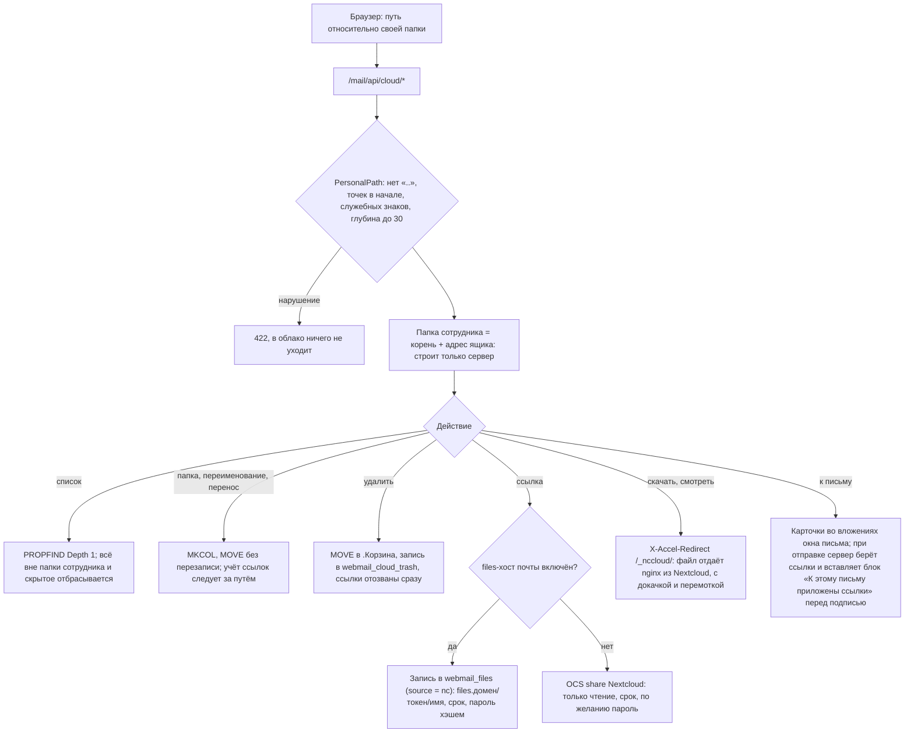
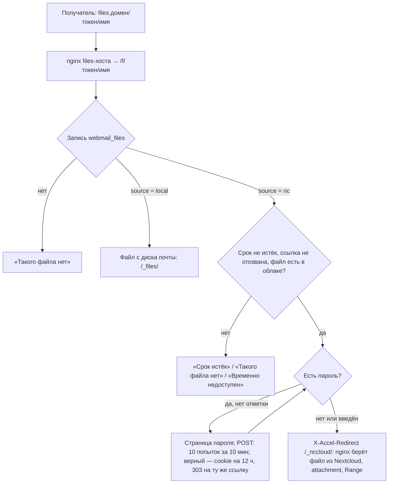
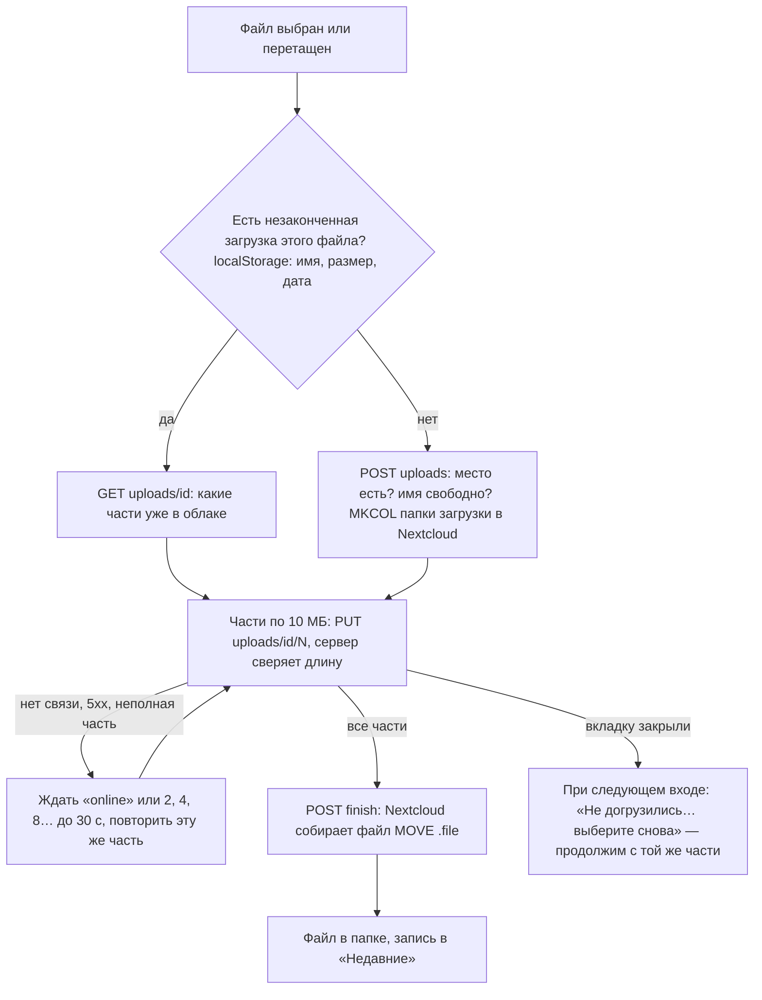

# Облако сотрудника

Раздел «Облако» в веб-почте: у каждого ящика своя папка для файлов любого размера. Файлы лежат
в Nextcloud, у одной служебной учётки, в папке `<корень>/<адрес ящика>`; сотрудник в Nextcloud
не заходит, всё идёт через почту. Общего доступа между сотрудниками нет, наружу — публичная
ссылка на отдельный файл.

## Файл облака в письме

В окне письма выбранные файлы облака стоят карточками рядом с вложениями (`cloudFiles` в форме:
путь, имя, размер). В черновик ссылки не вставляются — выбор хранится заголовками
`X-Mailadmin-Cloud` (base64 от JSON) и при открытии черновика возвращается карточками. При отправке
`MailBuilder` берёт ссылки через `PersonalCloud::attach` (действующая или новая, просроченная —
продлевается) и вставляет блок ссылок перед подписью, как у больших вложений. Файл успели удалить —
письмо не уходит, человек видит, какого файла нет.

## Ссылка на файл облака

Если в «Настройки → Файлы и облако» включён files-хост почты, ссылка на файл облака выглядит так же,
как у больших вложений: `https://files.<домен>/<токен>/<имя>`, и по щелчку файл сразу скачивается.
Получатель облака не видит. Запись о ссылке лежит в `webmail_files` с `source = nc` и пустым `path`,
а путь в облаке берётся из `webmail_cloud_links` (`share_id` = `f<id записи>`) — он переезжает вместе
с файлом при переименовании и переносе. Хранилище больших вложений такие записи не трогает: не
проверяет на диске, не удаляет по сроку, не считает в занятое место и не кладёт в «Скачать все».

Если files-хоста нет, ссылка — публичная ссылка Nextcloud (OCS share). Включили или выключили
files-хост — старые ссылки при следующем изменении или «к письму» заменяются ссылками нового вида
(у запароленной — новый пароль: старый хранится хэшем).

## Загрузка частями с докачкой

## Код и настройка

| Что | Где |
|---|---|
| Пути и изоляция | `app/Services/Cloud/PersonalPath.php`, тест `PersonalPathTest` |
| Работа с Nextcloud | `app/Services/Cloud/PersonalCloud.php`, тест `PersonalCloudTest` (имитация Nextcloud) |
| Учёт: ссылки, загрузки, корзина | `CloudLedger`, `DbCloudLedger`, таблицы `webmail_cloud_links`, `_uploads`, `_trash` |
| API | `Mail/Api/PersonalCloudController`, маршруты `/mail/api/cloud/*` |
| Страница | `/cloud` → `Pages/Mail/Cloud.vue`; очередь загрузки `resources/js/mail/cloudUpload.js` |
| В письме | кнопка «облако» в окне письма → `Components/Mail/CloudPicker.vue` |
| Выдача по ссылке files-хоста | `Mail/FilesController` (ветка `fromCloud`), страница `resources/views/mail/file-password.blade.php` |
| nginx | `deploy/nccloud-accel.sh` (вызывают `update.sh` и `files-host.sh`): location `/_nccloud/` в сниппете почты и в `files.conf` |
| Корзина по сроку | `cloud:purge-trash`, ежедневно 04:45 |

Включение: админка → «Настройки → Файлы и облако». Nextcloud подключается служебной учёткой
(лучше отдельная локальная, не из домена), затем переключатель «Облако сотрудников»: место
на сотрудника, срок ссылки по умолчанию, срок корзины, имя корневой папки.
