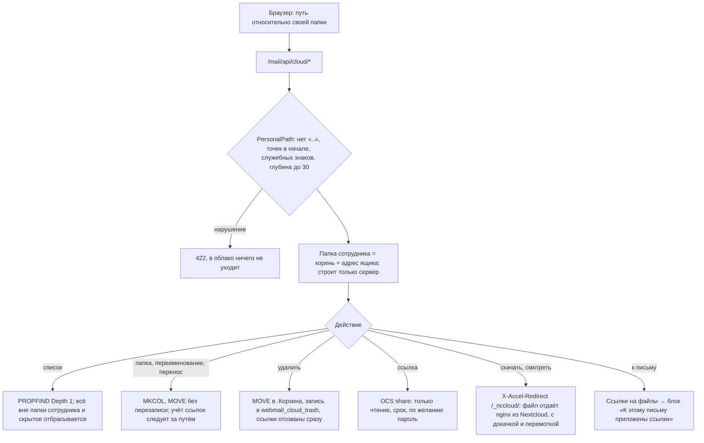
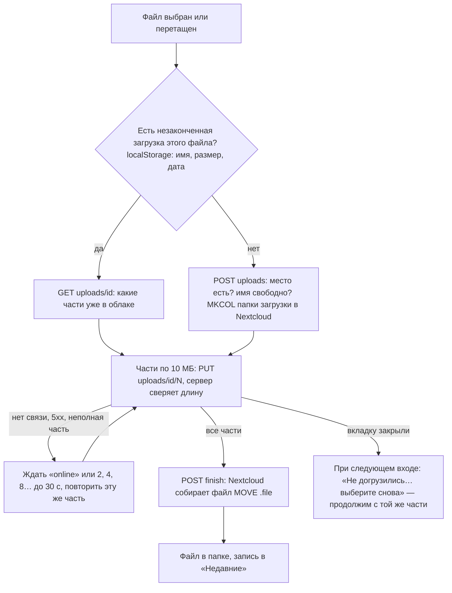

# Облако сотрудника

Раздел «Облако» в веб-почте: у каждого ящика своя папка для файлов любого размера. Файлы лежат
в Nextcloud, у одной служебной учётки, в папке `<корень>/<адрес ящика>`; сотрудник в Nextcloud
не заходит, всё идёт через почту. Общего доступа между сотрудниками нет, наружу — публичная
ссылка на отдельный файл.

## Загрузка частями с докачкой

## Код и настройка

| Что | Где |
|---|---|
| Пути и изоляция | `app/Services/Cloud/PersonalPath.php`, тест `PersonalPathTest` |
| Работа с Nextcloud | `app/Services/Cloud/PersonalCloud.php`, тест `PersonalCloudTest` (имитация Nextcloud) |
| Учёт: ссылки, загрузки, корзина | `CloudLedger`, `DbCloudLedger`, таблицы `webmail_cloud_links`, `_uploads`, `_trash` |
| API | `Mail/Api/PersonalCloudController`, маршруты `/mail/api/cloud/*` |
| Страница | `/cloud` → `Pages/Mail/Cloud.vue`; очередь загрузки `resources/js/mail/cloudUpload.js` |
| В письме | кнопка «облако» в окне письма → `Components/Mail/CloudPicker.vue` |
| nginx | `deploy/nccloud-accel.sh` (вызывает `update.sh`): location `/_nccloud/` |
| Корзина по сроку | `cloud:purge-trash`, ежедневно 04:45 |

Включение: админка → «Настройки → Файлы и облако». Nextcloud подключается служебной учёткой
(лучше отдельная локальная, не из домена), затем переключатель «Облако сотрудников»: место
на сотрудника, срок ссылки по умолчанию, срок корзины, имя корневой папки.
