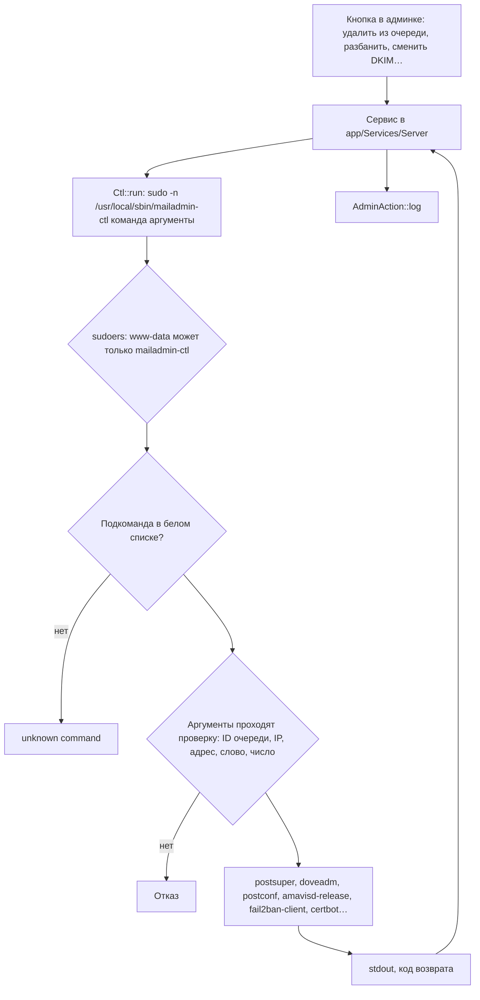

# Операции с правами root через `mailadmin-ctl`

Веб-процесс работает от www-data и сам ничего не меняет в системе. Всё, для чего нужен root,
проходит через одну sudo-обёртку с белым списком подкоманд и проверкой каждого аргумента.

| Группа | Подкоманды | Кто вызывает |
|---|---|---|
| Очередь Postfix | `queue-json`, `queue-cat`, `queue-retry`, `queue-hold`, `queue-release`, `queue-delete`, `queue-flush` | `Server/PostfixQueue` |
| fail2ban | `f2b-status`, `f2b-banned`, `f2b-ban`, `f2b-unban`, `f2b-ignore`, `f2b-config` | `Server/Fail2ban`, `LimitsController` |
| Dovecot | `who`, `kick`, `acl-get`, `acl-set`, `acl-delete` | `Server/Sessions`, `Mail/FolderShares` |
| Sieve | `sieve-global` | `Mail/SenderRules` |
| Postfix, Amavis, iRedAPD | `postconf-get`, `postconf-set`, `amavis-*`, `iredapd-*`, `external-senders` | `Server/AmavisConfig`, `Server/Quarantine`, `Server/ExternalSenders` |
| DKIM, сертификат | `dkim-txt`, `dkim-info`, `dkim-rotate`, `cert-*`, `profile-sign` | `DomainsController`, `Server/Certificate`, `AutoconfigController` |
| Резервные копии | `backup-run`, `backup-list`, `backup-restore-mailbox` | `Server/BackupService` |
| Рассылки | `mlmmj-*` | `Server/Mlmmj` |
| Система, антиспам | `sysinfo`, `spam-*`, `bayes-magic`, `salearn-*`, `report-delete` | `Server/HealthChecks`, `Server/Antispam`, `Server/SystemReports` |

Обёртка лежит в `deploy/mailadmin-ctl` и переустанавливается `update.sh`. Новая операция
root добавляется только сюда, с проверкой аргументов, и вызывается через `Ctl::run()` / `Ctl::out()`.
