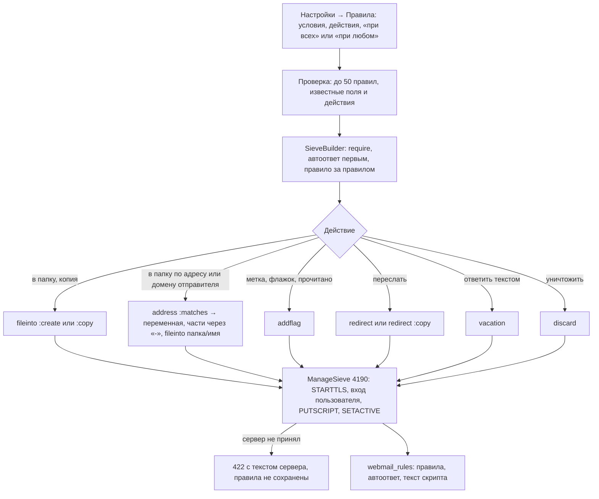
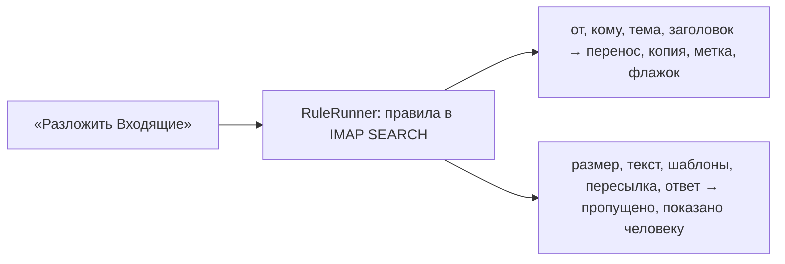

# Правила разбора и автоответ

Правила хранятся в базе как JSON и собираются в скрипт Sieve, который Dovecot выполняет
при доставке. Сначала сервер должен принять скрипт, только потом правила сохраняются.

## Код

`Mail/Api/RulesController` (`show`, `update`, `apply`), `SieveBuilder`, `ManageSieveClient`,
`Models/Webmail/RuleSet`, `RuleRunner`, `RuleFolders`; клиент — `mail/useMailRules.js`,
`Pages/Mail/Settings.vue`.

Правила работают только для входящих: Sieve не видит отправленные письма.
Порядок при доставке: общий Sieve iRedMail → общий Sieve приложения → скрипт пользователя
([входящая почта](inbound-mail.md)).
