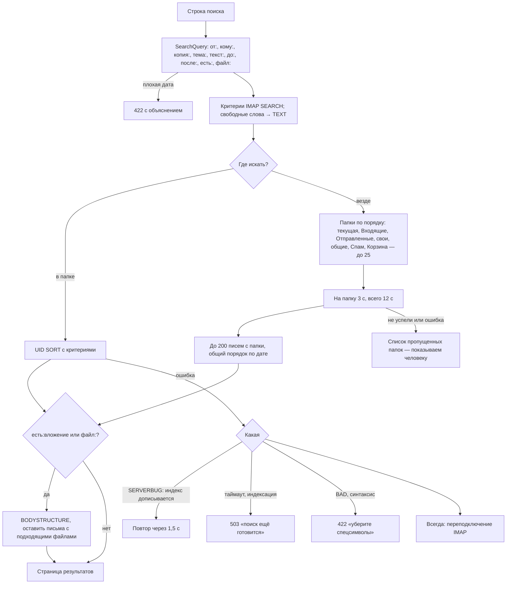

# Поиск

Строка поиска понимает операторы и превращается в IMAP SEARCH. Текст ищет полнотекстовый
индекс Dovecot (fts_xapian), имена файлов и признак вложения — разбор структуры писем.

## Код

`SearchQuery`, `MessageListing::list`, `MessageListing::searchEverywhere`, `ImapQuery::searchUids`,
`ImapQuery::keepWithFile`, `Structure::files`.

Полнотекстовый индекс отвечает только по From, To, Cc, Bcc, Subject, Message-ID и тексту.
По другим заголовкам поиск молча пуст — см. [подводные камни](../gotchas.md#dovecot).
