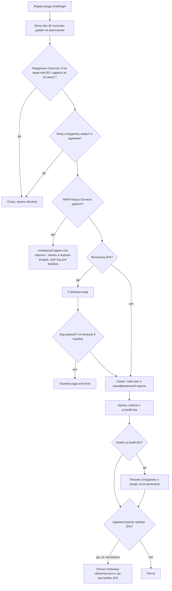
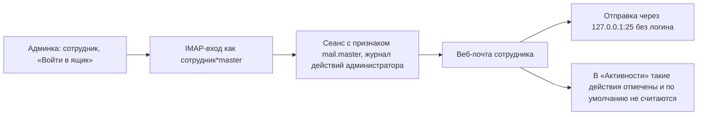

# Вход в веб-почту, 2FA, вход администратора в ящик, выход

Пароль проверяет сам Dovecot: приложение пробует войти по IMAP. Своих паролей
сотрудников приложение не хранит, в сеансе лежит только зашифрованная копия для работы с IMAP.

## Код

| Шаг | Где |
|---|---|
| Вход, код 2FA, выход | `Mail/LoginController` (`store`, `verifyCode`, `complete`, `destroy`) |
| Проверка пароля | `ImapSession::verify`, `ImapSession::login` |
| Каждый запрос | `EnsureMailSession`: есть ли `mail.user`, отметка сеанса, режим «только безопасность» |
| Журнал входов, блокировки | `MailLogin` (`mail_logins`) |
| Сеансы, выход с других устройств | `MailSession`, `Server/Sessions` (`doveadm kick` через `mailadmin-ctl`) |
| 2FA, пароли приложений | `Mail/Api/SecurityController` |
| Вход администратора в ящик | `EmployeeController::impersonate`, `ImapSession::loginAs` |

Ключи сеанса: `mail.user`, `mail.secret` (зашифрованный пароль), `mail.master`, `mail.force2fa`,
`mail.pending` (ждёт кода), `mail.2fa.setup`.

Если пароль сотрудника сменили, следующий запрос к IMAP получает AUTHENTICATIONFAILED:
сеанс сбрасывается, клиент показывает вход заново.
