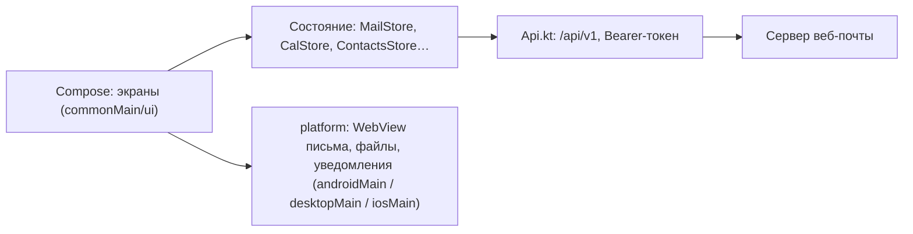

# Мобильное приложение «Почта»

Kotlin Multiplatform + Compose Multiplatform: один код интерфейса и логики для Android, ПК (Windows,
Linux, macOS) и iPhone. Приложение ходит не в IMAP, а в API сервера (`/api/v1`, [docs/mobile-api.md](../docs/mobile-api.md)) —
те же контроллеры, что у веб-почты, вход по токену устройства.



## Что где

| Путь | Что |
|---|---|
| `composeApp/src/commonMain/.../api` | модели и клиент API — всё, что умеет сервер |
| `.../data` | вход (`Session`: сервер, токен, настройки приложения), проверка новых писем (`MailCheck`) |
| `.../ui/mail` | папки, список, письмо, «Написать», карантин, «ждут отправки», доступ к папкам |
| `.../ui/calendar`, `ui/contacts`, `ui/cloud`, `ui/more` | остальные разделы и «Ещё» (настройки, правила, безопасность, обращения, обновления) |
| `.../ui/IconPaths.kt` | значки веб-почты, генерируются `python mobile/tools/gen_icons.py` из `Icon.vue` |
| `composeApp/src/androidMain` | Android: WebView письма, шифрованное хранилище токена (Android Keystore), загрузки, уведомления, WorkManager |
| `composeApp/src/desktopMain` | ПК: окно, файлы в «Загрузки», письмо — текстом со ссылками |
| `composeApp/src/iosMain`, `iosApp/` | iPhone: заготовка, собирается только на Mac |

Экранов три раскладки: телефон (нижняя панель), планшет (панель слева + список и письмо рядом),
широкий экран (папки + список + письмо).

## Сборка

Нужны JDK 17+ и Android SDK (платформа 36). На ПК администратора всё лежит в `C:\Users\User\devtools`
(`jdk21`, `android-sdk`), путь к SDK — в `mobile/local.properties` (в репозиторий не попадает).

```bash
cd mobile
./gradlew :composeApp:assembleDebug        # APK для проверки: composeApp/build/outputs/apk/debug/
./gradlew :composeApp:run                  # версия для ПК
./gradlew :composeApp:packageMsi           # установщик для Windows
```

Выпуск для людей — только подписанный (`assembleRelease` + `mobile/keystore.properties`, ключ хранит
администратор). Выпуск через GitHub: поднять `appVersion`/`appVersionCode` в `composeApp/build.gradle.kts`,
дописать `CHANGELOG.md`, поставить метку `mobile-vX.Y.Z` — `.github/workflows/mobile-release.yml` соберёт APK
и выложит его в Releases. Установленное приложение увидит выпуск само («Ещё → О приложении»).

## Тесты

- `CoreTest` (общий код): адреса папок, HTML ↔ текст, даты, разбор ответов и ошибок API на подставном сервере.
- `LiveApiTest`, `LiveWriteTest`: против живого сервера — чтение всех разделов и запись с откатом (контакт,
  событие, задача, метка, облако, письмо самому себе с вложением). Нужен токен тестового ящика в
  `MAILADMIN_TEST_TOKEN` (у администратора его выдаёт `ux/_mtest.py`, в репозиторий не попадает).
- `DesktopShotTest`: окно ПК со снимками в `composeApp/build/shots/`.
- Экраны Android — на эмуляторе (`ux/_mdev.py`: установка, вход токеном без ввода пароля, снимки).

## iPhone

Код для iPhone (`iosMain`, `iosApp/`) написан, но собран может быть только на Mac с Xcode, и нужен
аккаунт разработчика Apple. На первой сборке:

1. В Xcode создать проект `iosApp` (SwiftUI) из файлов `iosApp/iosApp`, добавить шаг сборки
   `cd "$SRCROOT/.." && ./gradlew :composeApp:embedAndSignAppleFrameworkForXcode` и подключить фреймворк `ComposeApp`.
2. Токен перенести из `NSUserDefaults` в Keychain (`KeyValueStore` в `Platform.ios.kt`).
3. Доделать выбор файлов (`rememberFilePicker` — UIDocumentPicker) и push через APNs.

## Уведомления

Пока без Firebase: Android проверяет «Входящие» примерно раз в 15 минут (WorkManager) и сразу при
открытии приложения; уведомление — «отправитель — тема», текст берётся с нашего сервера. Мгновенные
push — после создания проекта Firebase (docs/mobile-api.md, раздел 5).
